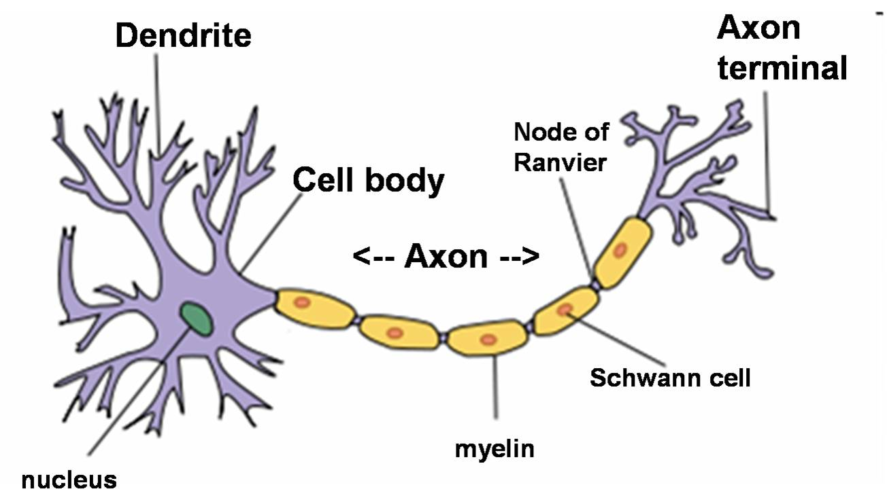
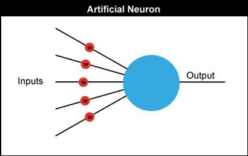
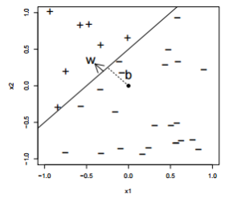

We want to install the following packages this week:
  - Numpy
  - Matplotlib
  - Jupyter

The main goals of this session is to get our feet wet programming in Python and to understand some of the basics of machine learning by coding a perceptron.

## Neurons

As an abstraction, a neuron can be viewed as the most basic unit of computation, similar to a logic gate.
A logic gate is the most basic unit of digital computing: It receives some electrical input or inputs and provides some output, usually after some function (linear or non-linear.)

A /real/ neuron consists of a dendrite, which collects and transforms inputs from other areas of the brain, a cell body that accumulates these inputs and an output that is transmisted through an axon.
Clearly they share a lot of similiarities with logic gates.
However, there are many details and vast differences when digging past this simple analogy.
As an example, there are 100s of different kinds of neurons, connected in many different ways depending on brain area and purpose, and the dynamics of neurons are also vastly complicated.

The artificial neurons we'll be dealing with are much simpler than real neurons.
We just require that they take some inputs, changed a by connection weights, and compute some non-linear function based on that.

More explicitly, we want the neuron to implement the following function:

$h = f\left( \displaystyle \sum_i \left(x_i \cdot w_i\right) + b \right) = f(\vec w \cdot \vec x + b)$

Where:
  - $\vec x$ is the input to the neuron; $x_i$ is the i'th component of that input
  - $\vec w$ is the weights leading to that neuron; $w_i$ is the i'th component of the weights
  - $b$ is the bias
  - $f$ is some non-linear function

We'll call this a neuron. or a unit.

## Perceptron

Let's just concentrate on a model with some set of input neurons and some set of output neurons.
The output neurons will take some value from the inputs, multiply that by the weights, and then pass that through a non-linear function.
We can choose the Heavyside function to be our non-linearity such that the perceptron will output one of two labels: 0 or 1.

This system turns out to be very robust and useful at solving a wide variety of classification problems.
However, it can only solve linearly separable problems.

### Considerations: Cost Function
In the 2D case, it is easy to plot the data and check that your choice of weights is actually separating the data.
However, when we jump to higher dimensions (sometimes millions of dimensions), this becomes impossible.
For that reason we turn to a cost function: a way of evaluating how well our solution is performing.
In the case of the perceptron we want for one set of data to lie above the plane (the positive side, or the side labeled as 1) and the other set to lie below the plane (the negative side or the side labeled as 0.)

Therefore one of the possible cost functions we could use is:

$C(y, \hat y) = (y -  \hat y)$

Where:
  - $y$: is the class of the input (ie 0 or 1)
  - $\hat y$: is the model's predicted class given the input (again 0 or 1)

Another popular cost function is:

$C(y, \hat y) = \frac{1}{2}(y -  \hat y)^2$

There are many others and it is one of the key choices in the algorithm design. We will be using the first one for the perceptron.

### Considerations: Training Algorithm
For real problems it is untractable to manipulate the weights individually and manually. This where the _machine_ part of machine learning comes in. We want an algorithm that can manipulate the weights towards a solution that minimizes the cost function (ie it brings the model closer to a good solution.) For the perceptron we have a pretty simple way of updating the weights.

$\vec w_{i+1} = \vec w_i + (\hat y - y)\cdot\vec x$

What this equation does is to update to the weights based on the cost and the input that made that cost. If $\hat y = y$ then the difference will be zero and the weights will remain the same, however if the they are not equal then there will be some update to the weights. If the difference is positive ($(\hat y - y) > 0$) then we'll move the weight vector closer to $\vec x$. If the difference is negative ($(\hat y - y) > 0$) then we'll move the weight vector to be anti-parallel (pointing in exactly the opposite direction) of $\vec x$.
