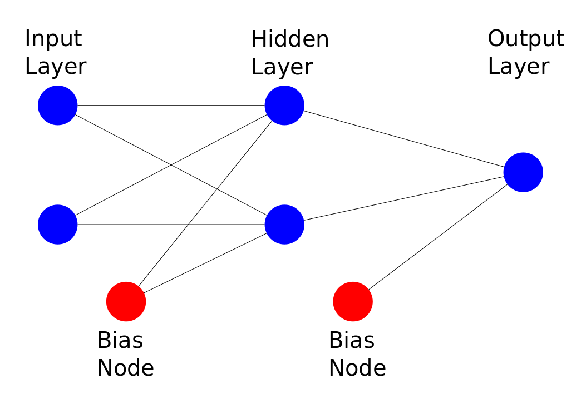

For this session you'll need to install Keras.
A simple pip install keras should be enough.

It is recommended that you read the jupyter notebook for this to get the proper equation rendering.

# Introduction to Multi-layer Perceptrons

In the last session we took a look at a simple perceptron. However, we quickly discovered one of its limitations: perceptrons can only solve linear problems. The vast majority of interesting problems are actually non-linear problems, ie problems for which the decision boundary has to be more complicated than a simple straight line.

Problem 5 from the last session introduced an interesting concept though. We had a dataset where one class was clustered around the origin, and the other class was spread in a wide circle around it. This problem is clearly not linearly separable. However, by transforming our dataset to polar coordinates, we found that it was possible to linearly separate the classes in that coordinate-set. This prompts the idea: what if our non-linear problems can be transformed into linear problems? Moreover, what if we didn't have to learn that transformation ourselves, but could make our algorithm learn it on the fly?

This is the intuition behind the multilayer perceptron (MLP). We want to design a learning algorithm that can handle non-linear problems by transforming them into easier linear problems. So what happens if we stick two perceptrons end to end?

## The activation

We generally call the first and last layers of the MLP the input and output layers respectively. The layers in the middle are the hidden layers, so called because we don't directly observe them (though we could if we wanted to). For a simple 1-hidden layer MLP, we'll have two weight matrices: one to go from the input layer to the hidden layer, and a separate one to go from the hidden layer to the output layer. For now let $\sigma$ be a non-linear activation function (last session we used the heavyside, but for some reasons explained later this is not a good choice for the MLP); the activation of the hidden layer can be written as:

$\vec z^1 = W^{1} \vec x + \vec b^{1}$

$\vec a^{1} = \sigma (\vec z^1)$

Where:
  - $z^1$ is the accumulation and bias of the first to second layer
  - $W^{1}$ is the weight matrix going from the first layer to the second layer
  - $\vec x$ is the input activations (ie just the inputs)
  - $\vec b^1$ is the bias for the first hidden layer
  - $\vec a^1$ is the activation of the first hidden layer
  
The output can be calculated using:

$\vec z^2 = W^{2} \vec a^{1} + \vec b^{2}$

$\hat y = \sigma (z^2)$

With similar definitions as above. If we put both of them together we get the following equation:

$\hat y = \sigma (W^{2} \, \sigma (W^{1} \vec x + \vec b^{1}) + \vec b^{2})$

This can obviously keep scaling for more and more hidden layers. The important part is that for each hidden layer and the output layer we simply need to multiply the previous activation by the weight matrix and add the bias before putting the output through a non-linearity.

## Training Algorithm

It might not be obvious right away, but our previous training algorithm for the perceptron will not work for the MLP. The error on the output layer is obviously something involving $\hat y - y$, but what about the hidden layers?

This is where the math starts to get intesting for this problem. First we should define what is the cost that we want to minimize. For now let's pick the mean squared error:

$C(w) = \frac{1}{n}\displaystyle \sum_{i=0}^n \frac{1}{2}\big(f(x_i; w) - y_i\big)^2$

Where:
  - $f(x_i; w)$ is the output of our model ($\hat y$) written to make explicit the dependence on x and w
  - $x_i$ is the i'th data point in our data set
  - $w$ is the current choice of weights
  - $y_i$ is the known label for $x_i$
  
There are many ways to minimize multi-dimensional functions, but the standard way used in deep learning (which includes MLPs) is to use stochastic gradient descent (SGD). To use we'll need to calculate the derivative of the cost function with respect to the weights; to do so we'll use the backpropagation algorithm. Backprop is the _magic_ that makes neural networks work.

### Training Algorithm: Gradient Descent

Gradient descent can be understood outside the context of machine learning. The goal is to find an extrema of a function.
In order to do this we can use the gradient (derivative of the function). 

#### Gradient Descent Algorithm:
  1. Pick some initial value of $\vec x$
  2. Calculate the gradient $\nabla f(\vec x)$ at your initial guess
  3. Update your guess for the extrema using the gradient
  4. Repeat from step 2 until some exit condition is met

When you have to update the vector of parameters you have two options. If you're looking for the maximum of a function you want to follow the gradient (ie the direction that will lead to the greatest increase in the function):

$\vec x_{n+1} = \vec x_n + \lambda \, \nabla f(\vec x_n)$

If you're looking for the minima then you want to move in the exact opposite direction of the gradient (ie the direction of greatest decrease):

$\vec x_{n+1} = \vec x_n - \lambda \, \nabla f(\vec x_n)$

$\lambda$ is known as the step size, and is used to regulate how big of an update we'll do to our $x_n$. If we choose a large step size we might move quickly towards the extrema, but we might get stuck doing updates around it. If we choose a small step size we might get stuck in local minima and never get out. One common way of dealing with both of these problems is to start with a large learning rate, but decrease it on every repetition.

There are a variety of exit conditions that one could use for gradient descent. The most obvious one is to only allow some number of reptitions, that way we're known to have a program that will stop. Another common condition is to evaluate the function at each interation and keep track of the values. If the value does not seem to be moving towards an extrema anymore (ie stuck at some value) for some number of repetitions then exit. In some cases we might want any solution that is above/below some value, so checking for that could be another exit condition.

In the context of the MLP we clearly want to minimize the cost function. We can, for the sake of simplicity, use only some number of repetitions. The value of the step size is sometimes also called the _learning rate_.

However, to use this algorithm we need to be able to calculate the gradient of our cost function. This is where backpropagation comes in.

### Training Algorithm: Backpropagation

Backpropagation is essentially just an application of the chain rule from calculus. Let's review the basics of chain rule quickly: When trying to differentiate a function, first you differentiate the outside, then the inside, and keep going until you reach the variable you're differentiating with respect to. Let $f,g,h$ be arbitrary differentiable functions. Then:

$f(x) = g(h(x))$

$\frac{d\,f}{dx} = \frac{d\,g}{dh} \, \frac{d\,h}{dx} \, \frac{d\,x}{dx}$

Since $\frac{d\,x}{dx}=1$ we usually omit it. So how does this help us? Imagine you have a function built from many complicated parts, if you can abstract the complicated parts into separate, easy to differentiate functions, then we can use chain rule to find those derivatives.

##### Chain Rule Example:
Let's try with $f(x,y) = (x + y) \cdot x^2$ and find $\frac{\partial\,f}{\partial x}$:
  1. First let's separate the complicated equation into two:
    - $p(x) = x^2$
    - $q(x,y) = x + y$
    - so that $f(p,q) = q\cdot p$
  2. Now we can find $\frac{\partial\,f}{\partial p}$, $\frac{\partial\,f}{\partial q}$, $\frac{\partial\,p}{\partial x}$, and $\frac{\partial\,q}{\partial x}$
    - $\frac{\partial\,f}{\partial p} = q$
    - $\frac{\partial\,f}{\partial q} = p$
    - $\frac{\partial\,p}{\partial x} = 2x$
    - $\frac{\partial\,q}{\partial x} = 1$
  3. We can now build the $\frac{\partial\,f}{\partial x}$ as
    - $\frac{\partial\,f}{\partial x} = \frac{\partial\,f}{\partial p} \frac{\partial\,p}{\partial x} + \frac{\partial\,f}{\partial q} \frac{\partial\,q}{\partial x}$
    - $\frac{\partial\,f}{\partial x} = q \cdot 2x + p \cdot 1$
    - $\frac{\partial\,f}{\partial x} = (x+y) \cdot 2x + x^2$
    - $\frac{\partial\,f}{\partial x} = 3x^2 + 2xy$
    

We can visualize that chain rule using a graph diagram, where each node is some function (that is hopefully easy to derive), and each edge represent the output of the previous node. We can then follow the graph back to its root and find all the partial derivatives we need.

##### Backprop Example:

Importantly, this algorithm doesn't just work for finding symbolic derivatives; we can also use it to find numerical derivatives. We just have to propagate the values of the derivatives from later on in the graph back to the roots. Take the above example, what is the value of $\frac{\partial\,f}{\partial x}$ when $x=2$, $y=1$? We can easily calculate $q$ and $p$ so that:

$\frac{\partial\,f}{\partial x} = \frac{\partial\,f}{\partial p} \frac{\partial\,p}{\partial x} + \frac{\partial\,f}{\partial q} \frac{\partial\,q}{\partial x}$

$\frac{\partial\,f}{\partial x} = 3 \cdot 4 + 4$

$\frac{\partial\,f}{\partial x} = 16$

Which is easy to verify as correct.

##### In the MLP:

Now we need use this in our MLP. This is complicated a bit because we're going to use vector-matrix notation throghout (trust me, it's better this way). The only thing we haven't decided is what $\sigma$ will be; for now we will choose $\sigma(x) = \frac{1}{1+e^{-x}}$.

Let's first find the derivative of our cost function with respect to $W^2$:

$\frac{\partial C}{\partial (W^2)} = \frac{\partial C}{\partial f} \frac{\partial f}{\partial \vec z^2} \frac{\partial \vec z^2}{\partial (W^2)}$

  - $\frac{\partial C}{\partial f} = \frac{1}{n} \displaystyle \sum_{i=0}^n \big( f(x_i; w - y_i) \big)$
  - $\frac{\partial f}{\partial (\vec z^2)} = \sigma(\vec z^2)(1-\sigma(\vec z^2))$
  - $\frac{\partial (\vec z^2)}{\partial (W^2)} = (\vec a^1)^T$
  
If you do a quick check you'll notice that $\frac{\partial C}{\partial (W^2)}$ ends up being a matrix with the same dimensions as $W^2$.

Now we need to do the same for $W^1$:

$\frac{\partial C}{\partial (W^1)} = \frac{\partial C}{\partial f} \frac{\partial f}{\partial \vec z^2} \frac{\partial \vec z^2}{\partial (\vec a^1)} \frac{\partial \vec a^1}{\partial (\vec z^1)} \frac{\partial \vec z^1}{\partial (W^1)} $

We can see that we get the first two terms for free, the third is actually just $(W^2)^T$. The fourth term is just the derivative of $\sigma$ again, but this time with respect to $\vec z^1$, and the final term is $(\vec x)^T$.

We also need to deal with the biases, but we can follow a similar procedure to the above.

##### Some programming considerations for the MLP:

Since there will be a lot of repetition as we backprop through more and more layers, we try to simplify terms so that what we need to do at each layer is as simple as possible.

  - $\vec \delta^L = \frac{\partial C}{\partial f} \frac{\partial f}{\partial (\vec z^L)}$ is the error on the last layer $L$
  - $\vec \delta^l = ((W^{l+1})^T \vec \delta^{l+1}) \cdot \sigma'(\vec z^l)$ is the error at the l'th layer
  - $\frac{\partial C}{\partial (W^l)} = \vec \delta^l \cdot (\vec a^{(l-1)})^T$ is the gradient with respect to $W^l$
  - $\frac{\partial C}{\partial (\vec b^l)} = \vec \delta^l $ is the gradient with respect to $\vec b^l$
  
These definitions just come from applying the rules above and condensing terms that accumulate at each layer. They are however much easier to deal with for deeper MLPs.

### Training Algorithm: Putting it together

Now we need to put all these steps together to be able to update the weights in our MLP. Generally we don't calculate the entire cost function, but use a small batch of data to approximate it.

#### Training Algorithm:
  1. Make a mini batch from the dataset
  2. Pass the batch through the dataset making sure to record all the activations, and $z$ values at each layer
  3. Calculate the aproximate cost
  4. Propagate the errors back through network, making sure to record all the relevant gradients
  5. Update the weights: $W^l_{n+1} = W^l_{n} - \nabla_{W^l_n} C$
  6. Repeat from step 1 until some exit condition is met

# Exercises

There are five exercises for this session. They're meant to help you understand all the things you need to code a simple 1-hidden layer perceptron. The first exercise is to use gradient descent to solve a simple optimization problem. Second exercise is to use backprop (and some basic calculus) to derive the backprop equations above for the 1-hidden layer MLP. The third exercise will be to put together the MLP and its training algorithm to solve the XOR problem.

The fourth exercise will be to use Keras to again solve the XOR problem. Keras is a high level neural network API that can use a variety of backends. The main backend is Tensorflow, a project backed by Google with lots of support.

The fifth exercise will be the bonus exercise from last week, but this time you will use Keras to solve it.
