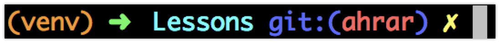

# A Pug's Life: Simple 2D game where a pug runs for his life while snacking on drumsticks

The happy, sunshiney little village of Nurltown has been overrun by angry jelly blobs, and a brave little pug must 
run for his life, while eating his beloved drumsticks!

## Objectives
* Learn the basics of object-oriented programming
* Learn the fundamental of game design, and the principles of a game engine
* Design a 2D game engine to run the game
* Add visual details and game features to create an immersive player experience

## Tools & Components
* python 3
* virtualenv for sandboxing python
* numpy numerical computation package
* pyGame library for game development

## Glossary
You can find the glossary of terms used throughout this project
[here](https://github.com/UWCoffeeNCode/Lessons/blob/master/S18/Projects/nurltown/tutorials/glossary.md).

## Tentative Syllabus
| Lesson # | Week # | Date          | Description                                    |
| :------- | ------ | ------------- | ---------------------------------------------- |
| -        | 4      | May 23, 2018  | Introductions & Sign-ups                       |
| 1        | 5      | May 30, 2018  | Intro to game design, tools & components, and installation of software |
| 2        | 6      | June 6, 2018  | `-- OPTIONAL MEETUP (AHRAR UNAVAILABLE) --` |
| 3        | 7      | June 13, 2018 | Finish installation; learn about object oriented programming  |
| 3        | 8      | June 20, 2018 | Work through Pygame tutorial; code the ecosystem and entities  |
| 4        | 9      | June 27, 2018 | Learn about pygame classes and populate the game with food and nurlets | 
| 6        | 10     | July 4, 2018  | Allow user to control nurlet; implement custom AI for enemies; begin personalizing game |
| 7        | 11     | July 11, 2018 | Show a health bar and allow nurlet to take damage; add final touches to game |
| 8        | 12     | July 16, 2018 | End-of-Term event! Show off your game to the world! |

## Project Members
* Ahrar Monsur (Team Lead)
* Aditi Sharma
* Akshar Goyal
* Jiwoo Jang
* Shivam Suthendran
* Jin Han

## Installation

For detailed instructions on how to install `python3` and `virtualenv`, read our
[**Python installation infosheet**](https://github.com/UWCoffeeNCode/resources/wiki/Installing-Python).

### Using Virtualenv

#### Instantiating the virtualenv

Virtualenv is a tool to create isolated Python environments - a sandbox for us to play around. This allows you to install
packages as necessary for a project without polluting your system installation of python. This utility also enables you to have
multiple projects running at the same time, each with its own virtual environment, perhaps even running different versions
of the versions of the same package (pretty cool, huh?).

To instantiate a virtual environment, navigate to the root directory for your project, and run

##### For Mac/Linux users

    virtualenv -p python3 venv
    
##### For Windows users

    virtualenv venv

This command will create the necessary files (and installations) for a virtualenv that is going to called `venv`
For this project, the instructions will be using this name for the virtualenv, but feel free to use any other name you wish,
as long as your consistent about replace `venv` in future instructions.

If you look at the files contained at the root directory, you will notice that a new folder has appeared called
`venv/` (or another name you may have chosen). While the virtualenv is active, any packages you install will be scoped
to this virtuial environment. If ever you are unsatisfied with the packages you have installed and want to restart,
you can simply delete this folder and start fresh. No harm, no foul!

#### Activating your virtualenv

To activate the virtualenv:

##### For Mac/Linux users
Navigate to the root directory for your project, and run

    source venv/bin/activate

##### For Windows users
Navigate to the root directory for your project, and run

    venv\Scripts\activate

When this command successfully runs, it is likely that you will see a change in your Command Line Interface (CLI, the terminal)
For example, before activating the virtualenv, my CLI looked like:

And after running the command, it looked like:

As we proceed with the project, whenever you are installing a python package, you can use this as
a visual indicator that your virtualenv is activated. If it is not, then always remember to activate it first.

#### Deactivating your virtualenv

If you are done working on the project and want to turn off your virtualenv, you can simply run

    deactivate

### Installing Pygame

To install pygame, first ensure that you have your virtualenv activate. Then run the following command:

    pip install pygame

To verify that pygame was properly installed, you can try playing one of the example games included in the installation

    python3 -m pygame.examples.aliens

#### Addition note for Mac OS X users
If you are working on a Mac, chances are your will not be able to control the game because the window will be unresponsive.
Don't worry, this is a known issue that is described and resolved [here](https://www.pygame.org/wiki/GettingStarted#Mac%20installation).

The summary is that you walk back your pygame installation and installing another package `venvdotapp` (fixes the
unfocusing issue) before reinstalling pygame.

    pip uninstall pygame
    pip install venvdotapp
    venvdotapp
    pip install pygame

After you have done this extra step, try running the example game again to see if it works on your Mac. If you are still
having issues, feel free to reach out to one of the Coffee 'N Code execs for help!

#### Exploring Pygame
Once you have successfully installed the pygame package, you can learn the basics from the our 
[**pygame tutorial**](https://github.com/UWCoffeeNCode/Lessons/blob/master/S18/Projects/nurltown/tutorials/creating_nurltown.md).
Specifically, I advise you to watch the video series referenced in the tutorial; it is a great resource to understand the
process of creating the building blocks of a 2D game.

_authored by Ahrar Monsur_
    
