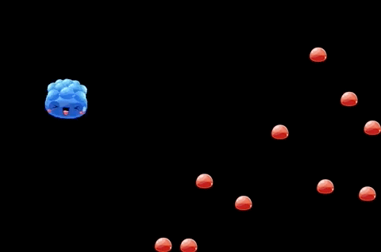
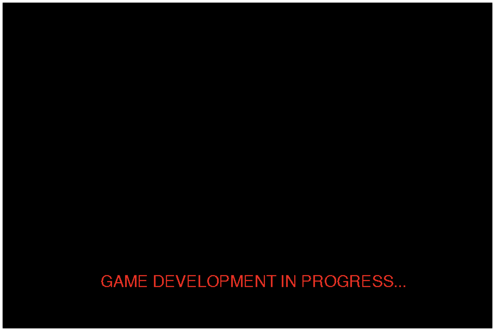

# Breathing Life Into Nurltown

In this tutorial, we will be creating the Nurltown ecosystem, and along the way, we will also be exloring the basics
of game development using the Pygame platform. We will be creating a 2D game world, populating it with entities
(nurles and food), and using that to understand some key concepts of game development such as
**the game loop**, **rendering**, and **game logic**.

For this introduction to pygame, we will be roughly following
[this youtube video series by sentdex](https://www.youtube.com/watch?v=ujOTNg17LjI&list=PLQVvvaa0QuDdLkP8MrOXLe_rKuf6r80KO).
As we progress through the components of Pygame, I will be adding further commentary to develop our understanding of
general programming and game development. That said, if you feel confident, definitely use the video series as an
extra resource to enrich your learning.

**NOTE:** Below is a step-by-step development of our understanding of pygame, where we will be discussing small
parts of the entire file at a time.

[**You can find the directory with complete files here**](https://github.com/UWCoffeeNCode/Lessons/blob/master/S18/Projects/nurltown/src).

When all is said and done, we expect our initial pass at the game to look something like this!



## Setting up a game configuration files

We will begin by writing a configuration file for our game. As we are developing the game, we can expect to be tweaking 
the look and behaviour of our game and the entities inside quite a bit! We would not want to be rooting through all of
our files everytime we do that. So, it's generally a good development practice to store most of game configurations and
parameters in one centralized file that all other files import necessary values from.

In the root directory of your project, create a file called `config.py`. Here we will be storing our configurations.
 
While you are at it, create another file and name it `__init__.py`. This can stay blank, but a file with that name needs
to exist in any directory we want python to recognize as an importable module. As we make new folders inside our root
directory, we will continue to add `__init__.py` files in those folders as well.

### A comment on commenting
In a python script file, anything following a `#` character in the same line is considered a *comment*. This is used
to describe code blocks, and meaningful reasoning behind your code.

Similarly, any text between triple quotes (`"""`), no matter how many lines, is also considered a comment.
This form is usually used for more formal documentation of functions, classes, and scripts. 

Comments are not required for a program to run (they are actually ignored by the interpreter) and are merely for the
benefit of humans. That said, I strongly urge you to write your own meaningful comments when you are creating these files.

### `config.py`

```python
"""
config.py
Module containing the configurations for the Nurltown ecosystem simulation
These configurations contain global and default parameters that dictate
the setup of the ecosystem and behaviors of the entities within, such as
nurlets, food, and obstacles
"""

# The game dimensions, as it will appear on your screen
GAME_WIDTH = 900
GAME_HEIGHT = 600

# The dimensions of nurlets
NURLET_WIDTH = 50
NURLET_HEIGHT = 50

# The speed at which the nurlets travel (# of pixels/frame)
NURLET_SPEED = 10

# The maximum angle of deflection from origin during the shuffling animation
NURLET_SHUFFLE_ANGLE = 15

# The maximum number of food entities which can exist at once in the ecosystem
MAX_NUM_FOOD = 10
```

**NOTE:** As we are working through this project, I will highly recommend that you are diligent about the following:
1. Write short descriptions at the top of files outlining its purpose and any special notes about the contents
2. Write meaningful comments beside sections of code about its purpose and justifications for any numbers or formulae used.

You would be surprised how quickly you can forget why you used a particular value or wrote a bit of code just days ago.
Writing meaningful comments not only guards against your human flaws, but it indicates good practice as a software
developer to anyone inspecting your code (potential employers included 😉).

---

We will also create another file in the root directory, and call it `colors.py`. This will be a file where we will
organize all the color descriptions we will be using throughout the game.

### `colors.py` 

```python
"""
colors.py
Module containing the standard descriptions of the colors used in Nurltown

When the colors are described as a 3-element tuple, it is the RGB description, with
each number representing the amount of intensity in the Red, Blue, Green channel, respectively
"""

red = 255, 0, 0
black = 0, 0, 0
```


## Primer on Python
As we proceed with the Nurltown tutorial, we going to be writing some code which assumes you have a working knowledge of
the python programming language. Specifically, we will be making use of the following concepts:
* arrays
* functions
* for-loops and list comprehensions
* while-loops
* classes

If you are not familiar with any of these concepts, I highly recommend you gain a basic understanding before proceeding
with the tutorial.
 
A great resource on python fundamentals is the
[**W3 Schools python tutorials**](https://www.w3schools.com/python/python_syntax.asp).  
For a more thorough look into Python classes and objects, watch
[**this video**](https://www.youtube.com/watch?v=apACNr7DC_s&index=2&t=2s&list=FLyURi69vc6vuSQ94cpE_sSA).


## Building the ecosystem

With the configuration files set up, we will now turn our attention to writing the script file `nurltown.py`, which will:
* serve as the entry point to our game (the program to run to start the game)
* run the [game loop](https://github.com/UWCoffeeNCode/Lessons/blob/master/S18/Projects/nurltown/tutorials/glossary.md#game-loop)

Navigate to the root directory and create a file with the name `nurltown.py`. Begin by declaring the module imports

### `nurltown.py`
```python
"""
nulrtown.py
Module containing the insertion point into the Nurltown game, along with configurations and utilities
"""

# Importing external modules.
# Some of the statements have the form 'import [THIS] as [THAT]', which just allows as to use
# a shorter alias (alternate name to target the module) to reduce the amount we have to type
import sys                      # Allows access to information about the computer, its filesystem, etc
import pygame as pg             # The Pygame module
import config as cfg            # The configuration file containing parameters about the game
import random as rd             # Module which has useful functions involving random numbers
import colors                   # Imports variables describing colors

```

Next, we will write a `main()` function. This function will be the entry-point into our game, and will be the function
which will be called when we run the `nurltown.py` python script (this file).

```python
def main():
    """
    This is the entry point in to the Nurltown ecosystem simulator. The function does the following:
    1. Instantiates a Pygame session
    2. Set the game configuration and utilities
    3. Populates the ecosystem with an initial collection of nurlets and food
    4. Continuously runs a loop of updating the states of the game entities and redrawing the game state
    """
    pass
    

# Make sure this always stays at the end of the file
# This code block ensures that the main() function (the entry point to the game) only runs if this script
# file is run directly, and not imported as a module.
if __name__ == "__main__":
    main()

```

#### Instantiate the game

Inside `main()` we start putting in the code to instantiate the game. This means deleting the `pass` statement inside the
function (you can keep the comments, if you wish) and writing the following code.

**NOTE:** The `...` in the snippet is not actually functional code. It merely represents things that may already
exist in the function (in this case, the documentation). This notation indicates that the snippet is to added to the function
after existing code.  
**Do not copy `...` into your file**

```python
def main():
    ...
    
    width, height = cfg.GAME_WIDTH, cfg.GAME_HEIGHT     # import the game dimensions from the configuration file
    pg.init()       # initialize the pygame module
    pg.font.init()  # initialize the font library
    
    # Create a text object to test the game loop
    test_font = pg.font.SysFont('Helvetica', 30)
    test_text = test_font.render('GAME DEVELOPMENT IN PROGRESS...', False, (255, 0, 0))
    
    screen = pg.display.set_mode((width, height))       # create a display object representing the game screen

```

#### The game loop

Next, we are going to tackle the meat of game engine: _the game loop_. In essense, this will be a while-loop within out
`main()` function, which runs continously until the user wants to exit the game. Inside this while loop, we will be writing
the code to listen to user input, update the game state, and redraw the game.

```python
def main():
    ...
    
    while True:
    
        # Handle the events that the game instance encounters
        # Events can be mouse movements/clicks, key presses, window resizing, joystick use, etc.
        # You can read more about the supported event types here:
        # https://www.pg.org/docs/ref/event.html
        for event in pg.event.get():

            # Quit the game and program when the 'x' button on the window is pressed
            if event.type == pg.QUIT: sys.exit()
            # Adds a quick way to exit the game by press the ';' button
            if event.type == pg.KEYDOWN and event.key == pg.K_SEMICOLON: sys.exit()

        # Clear the screen
        screen.fill(colors.black)
        
        # Display test text
        screen.blit(test_text, (180, 500))

        pg.display.update()
```

#### Test the game screen!

Open up your terminal (Mac/Linux) or command prompt (Windows), navigate to the root directory of the project, and run:

**NOTE:** Remember to turn on your virtual environment!
##### For Mac/Linux users
    python3 nurltown.py
    
##### For Windows users 
    python nurltown.py
or

    py nurltown.py

Now, if everything was done according to the plan (fingers crossed!), we should be able to run the script and see the
game screen!




---


_authored by Ahrar Monsur_