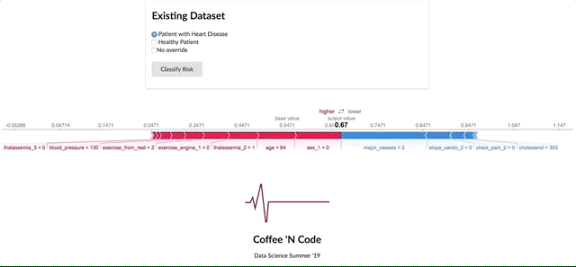

# Heart Disease Classifier

Over the course of the next few weeks, we will be creating a classifier to predict and classify heart disease. Heart disease is the leading cause of death in North America. Across the healthcare industry data science is being used to identify and predict medical conditions.

Screencap of the model predictions for patietns from the data science project of Summer 2019

Lessons will be divided on a learn model, implement model basis. The dataset we are using is the Cleveland hospital dataset for heart disease. This is a fairly popular dataset and there are many people who have also done exploratory data analyses in this exact same dataset.

This project is meant for all ages and experience levels. Taking this in regard, concepts will be slowed down and/or put in Layman's terms to be understandably for all audiences.

Here is our tentative syllabus. This is expected to change due to the progression of the course.

| Tables        | Schedule           |
| ------------- | ------------- |
| Week 1      | Learn AdaBoost |
| Week 2      | Implement AdaBoost to our heart disease classifier      |
| Week 3 | Learn random forest      |
| Week 4 | Implement random forest to our heart disease classifier |
| Week 5 | Learn K - Nearest Neighbors |
| Week 6 | Implement K - Nearest Neighbors to our heart disease classifier |
| Week 7 | Final project touch ups |

https://docs.google.com/presentation/d/15XswYXZcQ0r6md7pOtW1k8hPjH6afDJGK1fcwO6pR4U/edit?usp=sharing

