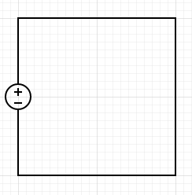
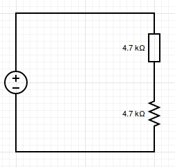
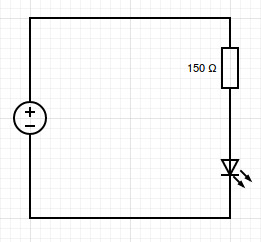
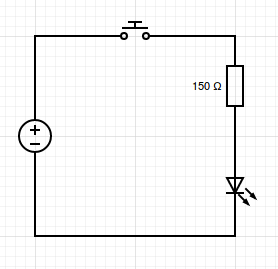

# Lesson 2: First Circuit

Our objective for this lesson is to start building simple circuits with and without the Arduino.
We will also talk about the basics of electricity and circuits.

## Basic Circuit Theory
We could start building circuits right away, but I find it is beneficial to have a framework in mind so that we can reason about our expectations.
An electrical circuits is a path through which electrical energy can travel.
For now, let's say that electrical energy is carried by the flow of electrons.
One of the fundamental rules of physics is that systems want to move to states that spread energy as much as possible (second law of thermodynamics, ie entropy).
That means that electrical energy will _always_ flow from a region of high energy to a region of low energy, until those two regions have the same amount of energy.
It also helps to remember that like charges repel and opposite charges attract. That means that two electrons right beside each other want to move away from each other (they have a lot of energy), and that one electron and one proton want to move closer together (they have less energy when they are together).

### Batteries
Let's think of a battery. One end is positively charged, while the other is negatively charged.
When you connect one end to the other, electrons begin to flow from the negative side to the positive side.
Once an equilibrium is reached (ie there are just as many electrons on the positive and negative sides) the flow of electrons stopped. In rechargeable batteries, we can move the electrons back so that we again have more electrons on the negative side.

We should never wire a battery directly to itself as shown above though.
If we do this all the energy will flow incredibly quickly from one side to the other and drain the battery, or break some other component. We call this a _short circuit_, electricity is flowing along a path that is shorter than we intend.

### Resistors
Instead we should put some kind of barrier to the flow of electrons so that the battery can discharge at a more controlled pace. We call these barriers resistors, because they resist the flow of electrical energy. Your run of the mill resistor is a small piece of ceramic that converts some of the electrical energy into thermal (heat) energy. Different resistors can oppose electrical flow to different extents, a property called resistance, which is generally measured in Ohms (named after German physicist [Georg Ohm](https://en.wikipedia.org/wiki/Georg_Ohm)).

There are two symbols used for resistors in circuit diagrams, the diagram above shows two 4.7 kilo Ohm resistors using each of the symbols. When electrons flow over the resistors they will dump some of their energy into them. More importantly they will dump enough energy so that by the time they clear all the resistant components in the circuit they will have virtually no electrical energy left!

### Ohm's Law: Voltage, Current and Resistance
Ohm discovered that there was a relationship between the amount of electrons flowing (current, I), the amount of energy carried by those electrons (voltage, V) and the amount of resistance (R) it takes to remove all that energy.

V = IR

* V is voltage, or a measure of how much energy is carried per unit charge (measured in Volts)
* I is current, or a measure of how many charges go through one point in a second (measured in Amperes)
* R is resistance, or a measure of how resistant to flow a component is (measured in Ohms)

Let's take a moment to go over what are voltage and current.
#### Current
Current is a measure of the flow of charge through an area. Alternatively, the current through a wire is the answer to the question:
how many Coulombs of charge are going through a point in the wire in a second?

Current is then Coulombs per second, but it also get it's own unit, the Ampere (A).
High current means that there is a lot of charge flowing. It does not mean that the charge is moving fast, or that the charge is very energetic.

#### Voltage
Voltage is a measure of how much energy there is per charge. You can also think of it as answering the question:
how many Joules of energy are being carried by one Coulomb of charge?

Voltage is then Joules per Coulomb. Voltage also gets its own unit, the Volt (V). High voltage means that each individual charge is carrying a lot of energy. It does not mean that there are a lot of charges.

#### Re-arranging
Let's think about what this equation is telling us. If we know the current (how many electrons are flowing) and the resistance, we can predict how much voltage will be dropped across that component!

If we know the voltage and the resistance, we can find the current by rearranging: I = V/R. So we can predict, very accurately how many electrons are going through that component!

There's only one other configuration we haven't investigated: we know the voltage dropped across the component and the amount of current flow, we can predict the resistance of that component: R = V/I

## Building a light circuit
Now let's talk about building a simple light circuit. The schematic is below. We'll need to talk a bit about light emitting diodes (LEDs) first, but you can see that the circuit itself is pretty simple.

### Light Emitting Diodes (LEDs)
Diodes are electrical elements that only allow current to flow in one direction.
They essenetially let us stop charge from flowing in a direction that we do not want.
As a result of that, diodes have directionality, ie it is possible to wire a diode backwards.
The general convention is that diodes will have some marking to tell you which leg is the input to the diode and which leg is the output.
If you do it wrong, at best your circuit will not work, and at worst the diode will melt or pop (this is hard to do, so don't worry about it!)

Interestingly, some diodes will emit light when charge is flowing through them.
These are known as light emitting diodes and they are the prime way you can add lights to your projects. The LEDs we will be using have a short leg and a long leg. The short leg is the output of the diode; it needs to be connected towards ground. The long leg is the input of the diode; it needs to be connected towards your power source.

Remember how I said before that you should never connect the battery (power source) straight to ground (negative terminal). A diode will allow charge to flow freely through it, so we need to limit this or we'll kill our battery and our LED as well. This is why we need to add a resistor to this circuit. The resistor will limit the current though the circuit and it will also let us set the voltage we want across the LED. We can calculate the resistor using Ohm's Law.

## Using an Arduino
We can program our Arduino to turn our LED on and off. You can essenetially use your blink sketch from last lesson and replace `BUILTIN_LED` with the appropriate pin number.

When the pin goes `HIGH`, we'll get 5V out of that pin. When the pin goes `LOW` we'll get 0V (ie current won't flow because there's nowehere lower to go to.)

## Optional
* Grab a pushbutton and built the following circuit:

* Grab a pushbutton and use Arduino's digitalRead to figure out when to turn the LED on/off.
