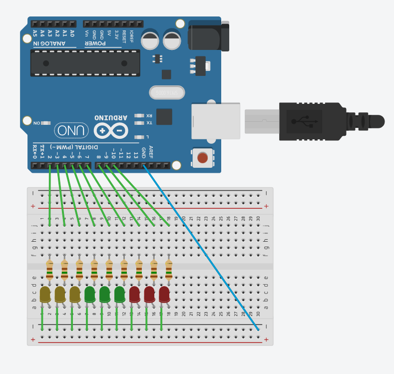

# Lesson 3: Using loops and Arrays

The objective for this lesson is to start building more complicated programs in
the Arduino IDE. Specifically we want to be able to program a row of LEDs to do
a variety of different patterns, and we want to do it in such a way that it is
reusable.

## Programming in Arduino
Arduino is programmed using the same syntax as C++, which means that is also
accepts C code. If you have ever programmed in C\C++ then the following syntax
should feel very familiar. If you have never programmed you'll find that the
concepts are easy to understand, but the syntax can be a bit hard to remember.
Don't worry, that's completely normal. Even senior developers look up the basics
 from time to time!

If you ever come across a function or concept you've never seen before in
Arduino, your best bet is to take a look at the [language reference](https://www.arduino.cc/reference/en/) on the official website.
The documentation is very thorough and has lots of examples.

Let's talk briefly about the life-cycle of our Arduino code.
The first step is to write the code on your computer. This will generallly be
the longest step you as the programmer will be involced in. Writing code is not
just the act of typing into the computer, you will probably spend the majority
of that time thinking about what to write, and checking that what you have
written is right. The second step is to compile your written code. For our own
ease, we write in computer languages that straddle the line between pure machine
code and easy to understand written instructions. Different languages tackle
this problem differently and they make different trade-offs because of it. In
the end though, all of these languages need to translate to pure machine code
so that our computers can read and run the code. Compiling is the act of
grabbing our high-level code and turning it into a binary file that a machine
can read and execute. Compiling can take a long time if your code is complicated,
but it will never be as long as it takes to actually write the code. If you have
made any syntax errors while writing, the compiler will tend to catch those and
point them out. If you have made logical mistakes the compiler will not save you.
The last step in the life-cycle of code is executing (or running) the code. After
everything is in machine language the computer can run the code and give you
any results. This last step is the one where your code should spend the most
time, but it is also the one where you as a programmer will spend the least.

Obviously this a very basic, toned down, view of the life-cycle of code. You
should always be iterating, and testing, and that muddles the story above quite
a bit. I still think it is important to keep this in mind.

### Data Types
C is a statically typed language. That means that we need to tell the compiler
the type of each variable, _before_ we use the variable. For the most part,
C will _not_ perform type conversions for us either. Once you declare something,
you can pretty much think that that variable will stay that type, even as its
contents change.

Let's take a look at some types (though not all):

| Data Type | Size (bits) | Description |
| -------- | ------------- | ------------------------------------------------------|
| boolean | 8 | your standard logical true or false |
| byte | 8 | an integer from 0 to 255 |
| char | 8 | a number between -128 to 127, but the compiler will treat it as character at times |
| unsigned int | 16 | an integer between 0 and 65,535 |
| int | 16 | an integer between -32,768 and 32,767 |
| unsigned long | 32 | an integer between 0 and 4,294,967,295 |
| long | 32 | an integer from -2,147,483,648 and 2,147,483,647 |
| float | 32 | a decimal number from -3.4028235e38 to 3.4028235e38, operations on this type are slow and should be avoided |

As you can see there are a lot of data types just for numbers. There are also
data types for strings (collections of characters), but we won't be touching
those.

Let's take a look at an example:

```c++
int x;
int y;

x = 12
y = -10

int z = x + y;
```

You should always try to use the right data type for the purpose you are setting
out to acomplish. As an example, if you know a variable will always be a positive
integer less than 1,000, you should use an `unsigned int`, if you need to store
a time in milliseconds, you'll probably want an `unsigned long`. Math that
requires decimal precision should use a `float`, though bear in mind that
`float` is not naturally supported by the hardware and is "emulated" in software.
Doing operations with floats will always be slower than doing the same
operataions with ints.

### Conditionals
Conditionals are how we ask questions that are either `true` or `false`.
The question that you will see the most often is whether or not two variables
are equal or not. In C we use the double equals sign, `==`, to ask that question.
The statement will return a boolean, 0 or 1, `true` or `false`.

We can also ask if one number is greater than (`>`), less than (`<`), greater
than or equal ('>='), or less than or equal (`<=`).

The two basic boolean operations are `and` and `or`. Each of these two takes in
two inputs (in not prescribed order) and returns one output. `and` only returns
true if both inputs are `true`, while `or` returns `true` if any of the inputs is
 `true`. We tend to denote `true` with a 1 and `false` with a 0.

Let's take a look at some truth tables:

| A | B | AND |
|---|---|-----|
| 0 | 0 | 0 |
| 0 | 1 | 0 |
| 1 | 0 | 0 |
| 1 | 1 | 1 |

| A | B | OR |
|---|---|-----|
| 0 | 0 | 0 |
| 0 | 1 | 1 |
| 1 | 0 | 1 |
| 1 | 1 | 1 |

In C if you want to do this logical `and` you would use `&&`, while logical `or`
is `||` (the pipe symbol is generally above the enter key). And now an example:

```c++
int x = 3;
long y = -2391;

greater = y > x;
equal = x == x;

using_and = equal && greater;
using_or  = greater || equal;
```

There is one last important operation we can do on boolean variables, negation.
That is turning a variable holding `true` to `false`.
We can do this by using the tilde `~` before the variable name.


### If-Statements
Now that we know about conditionals, we can start to manipulate the flow of our
code execution. The first flow control method we'll look at is the `if` statement.

If-statements allow you to swap out what code will be executed based on a boolean
value, which can be calculated with a conditional. For example, `if` a number is
less than zero you want to multiply it by -1, `else` you want to multiply it by
+1. You can also chain if statements together to build more complicated control
flow. This can be done by using an `else` statement followed by a new `if`.

Let's take a look at the syntax:
```c++
int num = -5;
if (num <= 0){
    num = 0;
}


boolean isPushed = digitalRead(3);
if (isPushed){
  // do something
  activate_gizmo();
} else {
  // do something else
  activate_thingy();
}


unsigned int temp = analogRead(A1);
if (temp >= 25){
    turn_AC_on();
} else if (temp <= 18){
    turn_heating_on();
} else {
    turn_AC_off();
    turn_heating_off();
}
```

### Loops
Now let's talk about another form of flow control: loops.
Loops are the kind of structure you want to use when you need to do some
operation more than once. There are 3 kinds of loops you can have access to in
C: `while`, `for`, and `do-while`.

Again each of these uses conditionals. In this case they are used to decide how
often some block of code is going to be executed. The `while` loop is the
simplest.

```c++
boolean isPushed = true;
while (isPushed){
    // Keep doing things until the button is not being pushed
    record_data();

    // Remember to update the condition
    isPushed = digitalRead(12);
}
```

This loop will keep repeating the block between the braces so long as the
condition is `true`. If the condition never changes, then the loop will keep
repeating forever! Be careful you don't let that happen. You'll generally want
to use a `while` loop when you don't know how many times something needs to be
repeated, but you can figure out when to stop. Let's take a look at the next
kind of loop.

```c++
unsigned long curr = 1;
unsigned long old = 0;
unsigned long tmp = 0;
for (int i=0; i<100; i++){
    tmp = curr;
    curr = curr + old;
    old = tmp;
}
```

The `for` loop is a bit more comlicated to set-up. The syntax is as follows:
`for (initialization; condition; increment){}`. Notice the semi-colons!
Initialization is only runned once, and it is used to set-up the variable that
you'll be tracking. Condition is checked at the start of every loop iteration,
when it becomes false, the loop exits. Increment is runned at the end of every
loop. The `for` loop above, initializes a variable called `i` to 0, on the start
of every iteration it checks to see if `i < 100`, and at the end of every loop
it executes `i++`, which increments the value of `i` by one. The loop will keep
executing as long as `i` stays under 100, but the loop is rigged to increase `i`
every iteration, which  means that we're guaranteed not to have an infinte loop!
You'll want to use a `for` loop when you want to repeat something a known number
of times.

Let's take a look at the last loop, the `do-while`.

```c++
do {
  delay(100);
  // try to turn LEDs off
  isOff = turn_off();
} while (~isOff);
```

The `do-while` is a bit more comlicated to read, but the idea is pretty simple.
A `while` loop checks the condition at the beginning of the iteration, while
the `do-while` will check the condition at the end of the iteration. This means
that the statement inside the loop will be runned at least once! There are
situations where you know that you'll want to run something at least once, but
potentially multiple times until some condition is met. The example above gives
you some idea what a situation like that might look like. The above loop tries
to turn off some LEDs, and reports back on whether or not it was successful. If
it was succesful, then there is no need to loop, but if it failed for some
reason, then it will try again and again until it succeeds.

If you don't know what loop to use, you should start with a `for` loop first.
They're the safest (least likely to go infinite), and can conver a wide range of
possible scenarios. If a `for` loop doesn't fit your use case, then the next
thing to try is a `while` loop. `do-while` loops are very useful, but in my
experience they don't show up often.

### Arrays
Now that we know about loops we should also cover arrays. Arrays are a special
kind of data type: a container. Arrays are used to store ordered collections of
values. For example, let's say you want to store user input. You could
initialize an array that will store the input in the order it was given by the
user.

As far as programming, there a couple of things to keep in mind. Arrays can only
store one kind of data type. That means that if you initialize an array of
`int`s, you can only store `int`s in that array. Arrays are also initialized to
a fixed size, which means that if you find out you needed a bigger array you
cannot dynamically expand an existing array. To access the contents of an array
we use square brackets `[]`, and we use _zero indexing_. That means that the
first element is labeled 0, the second is labeled 1, and so on.

Let's see some examples:
```c++
// First we should declare an array
// array of length 10
int array_of_ints[10];
// array of floats, length is determined at compile time
float other_array[] = {4.43, 2.23, 6.299, 7.11, 43.111};
// length is 50, but it is initialized with some values
int last_array[50] = {1,2,3,3,2,1};


// Let's assign and access some values
// first element set to 55
array_of_ints[0] = 55;
// access second array element
x = other_array[1];
// overwrite fourth value
last_array[3] = 333;
```

We'll see more examples below.

### Functions
The last programming concept we'll cover is about writing and using functions.
Functions are collections of code that we recognize as being so useful and/or
general that we decide to package them up into a convenient form. For example,
we'll want to write a function that can control our LED strip since we'll be
turning LEDs on and off frequently.

Functions are our first introduction to a
programming concept: Don't Repeat Yourself (DRY). If some operation is so useful
that you need to do it more than once, you should strive to pack it up so that
the code for it only exists in one place. If you ever need to change the
operation, then there is only one place you need to apply changes to. If you
ever find any bugs in your code, then there is only one place you need to fix.
Keep this concept in mind as you program!

In C\C++, when we do a function declaration we need to tell the compiler what
data types the function takes as input, and what data type the function will
output. If our function will not output anything we use the keyword `void`. If
we do want to return something, we use the keyword `return`.

Let's take a look:
```c++
// this function encapsulates a common opertaion
float area_quadrilateral(float length, float width){
  area = length * width;
  return area;
}

// this one gives a common opertaion a more relevant name
int isPushed(){
  bool button = digitalRead(6);
  return button;
}
```

## Programming an LED strip
Now that we have some programming basics, we should wire up our own little LED
strip and start writing code for it!

### Set all the LEDs up
We need to make our LED strip first. The wiring is the same that as last week,
except that we want to organize a bit better so that we have a nice clean layout.

The two columns on either end of the breadboard are connected together. Usually
you'll see a `+` and `-` on these rows. We can use these to form a _ground rail_
(we can also make a power rail but we don't need one right now). We can make a
connection from our Arduino's GND pin, to the `-` rail to make that ground rail.

Next, we'll want to wire each resistor and LED. Since we have that ground rail we
can make sure that the short leg of each LED ends up on that rail, the long leg
can go in one of the many rows. We can use the split along the center of
breadboard to break the connection and wire our resistor across and finally
use a jumper cable to go to our Arduino pins.

Unless you have a perfect understanding of how my head works, you'll probablly
want the image below:



### Setting up code
There are a couple of things that we can set-up in our code to make our lives
easier: namely having an array of pin numbers to address our LEDs and functions
to use them.

You should copy the following snippets by hand (no ctrl-c!).
```c++
// if you use other pins you should sub them in here
// Notice the order of pins is such that if I go through
// the array from left to right, the LEDs will also light up
// from left to right
int myPins[] = {2, 3, 4, 5, 6, 7, 8, 9, 10};
int numLEDs = 9;

void turnLEDs(int value){
  for (int i=0; i<numLEDs; i++){
    digitalWrite(myPins[i], value);
  }
}

void setup(){
  for (int i=0; i<numLEDs; i++){
    pinMode(myPins[i], OUTPUT);
  }
}

void loop(){
  // You'll want to replace this code!
  delay(500);
  turnLEDs(HIGH);
  delay(500);
  turnLEDs(LOW);
}
```

Let's take a look at what we just wrote. First we initialize an array that will
keep the pin numbers we wired our LEDs up to. Notice that the order is such that
when we loop over it, the LEDs will be addressed left to right. We also made a
variable to let us know how many LEDs we wired up. We'll be using this for our
loops. Next we made a function so that we can turn all the LEDs on or off easily.
We achieve this by using a `for` loop to address each of the pins in order.
Finally we write our setup function such that all the pins are set to output.

The section inside the loop function is the regular blink, but addressing all
the LEDs at once. You'll want to play around with the contents of this function.

### Run-up and clear
Having said, here's a loop function that will turn all the LEDs on one at time
from left to right, and then turn them all off.

```c++
int counter = 0;
void loop(){
  if (counter==numLEDs){
    counter = 0;
    turnLEDs(LOW);
  } else {
    digitalWrite(myPins[counter], HIGH);
    counter++;
  }
  delay(200);
}
```

`counter` is initialized to 0, and increases until it matches the number of LEDs.
If it matches the number of LEDs, it sets all the LEDs `LOW`, else it sets the
next pin in the sequence `HIGH` and increases the counter. No matter what, on
each go around the `loop` function, we delay 200 milliseconds.

## Optional
For the optional challenges this week we'll be programming different patterns

* Have one LED on at a time and have it run up the strip and then appear back at the beginning

* Have one LED on at a time and have it run up the strip and then bounce back to the beginning and repeat

* Have the strip fill up one at time and then empty out one at time

* Switch between all of the above using a button
