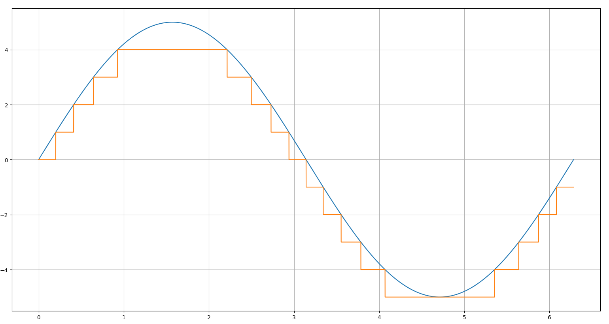
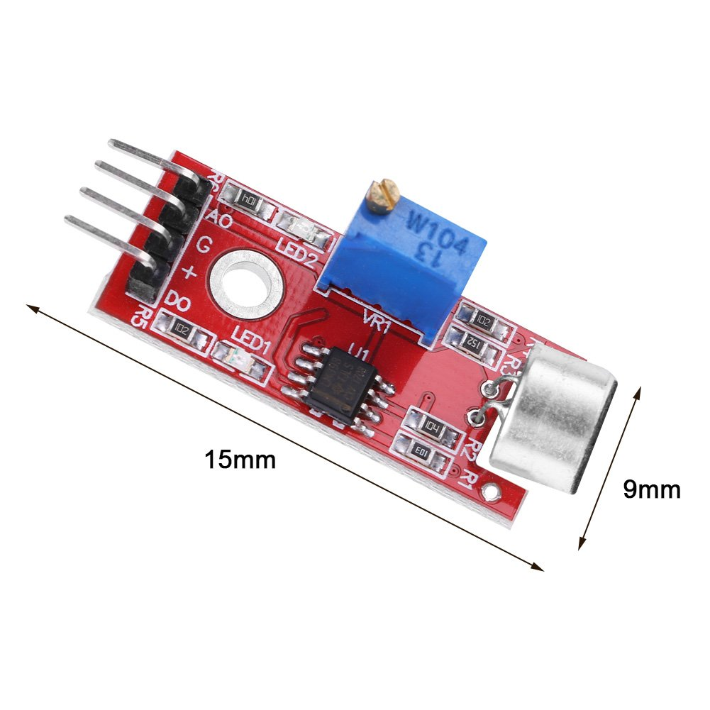

# Lesson 4: Reading from the Microphone

The objective for this lesson is to get ourselves aquainted with the microphone
we'll be using in this project, and to learn to how to read from it with our
Arduino.

## Reading Analog Data
An analog signal is one that changes smoothly with time. Contrast this with a
digital signal that can only change in predefined steps. In the image below, the
y-axis is the amplitude of the signal while the x-axis is time. The blue line
is an analog signal that you can see is smoothly changing with time. The orange
line is a digital _approximation_ to the same analog signal.



In this case, the steps on our digital signal are very big, which makes them
easy to see. In most cases you want to make your steps as small as possible, so
that the digital approximation is as close to the analog reality as possible.

The reason why we care about this is that our Arduino is a digital device. In
fact all of our modern electronics run on digital computers (analog computers
do exist though!). If all of our electronics is digital, it follows that we
cannot process an analog signal without translating it to digital first. To do
that we use an Analog to Digital Converter (ADC). Our Arduino have a 10-bit ADC,
which means that they can use up to 10-bits to approximate an analog signal.
Since we have 10-bits we can have 2 to the power of 10 steps, or 1024 steps.

The other thing our ADC will need is a reference voltage. We know that we want
to place step 0 at ground, and conversely we put step 1023 at our reference
voltage. Let's take a moment to think about that.

If our reference voltage is 5V, then that means that each of our steps will be
5V/1024 ~ 5mV. If we set a reference at 1V then each step will be 1mV. If
we could increase the number of steps (maybe by buying an Arduino with a 12-bit
ADC) then we could make the steps smaller. Remember, the smaller the steps the
better resolution we'll have, but if our signal goes above our reference we
won't be able to tell what the signal was doing while it is that high. If
resolution is important we should try to set our reference voltage such that it
is a little bit more than the max voltage we expect to see from our signal.

We can set the reference voltage two different ways. The easiest way is to use
a built-in reference voltage. We can use [`analogReference`](https://www.arduino.cc/reference/en/language/functions/analog-io/analogreference/)
to change to one of `DEFAULT`, `INTERNAL` or `EXTERNAL`. Default on our Arduino
Nano is set to 5V. Internal will set the reference to 1.1V. Be aware that both
of these values will depend on the kind of Arduino you have; some Arduinos run
at 3.3V or have the internal reference set to 2.56V. **Always read the
documentation before you wire anything!** The second way to set a reference is to
use the `EXTERNAL` reference. You can wire a reference voltage to the `VREF` pin
and the Arduino can use that as the reference voltage for all the analog
calculations. Be careful that your external reference is grounded to your Arduino,
and that it is steady. If your external reference varies with time, your
measurements will not be accurate.

We use the `analogRead` function when we want to read using the ADC. Only some
pins have ADC though; these are labeled with an A, instead of a D on the Arduino.
To access the A0 pin in the Arduino we can refer to it as `A0` (by contrast D3
is accessed by using the int `3`). It is also important to remember that
anything a digital pin can do, an analog pin can do as well. Think of the analog
pins as super pins that can do a bit more than normal.

## Microphone
Let's take a look at the microphone we have our hands on.



Let's identify all the components:

* Big round part is clearly the microphone
* Big blue rectangle is a variable resistor
* We have four pins: Analog out, Ground, V-in, Digital out
* Little black square is an LM393: a pair of amplifiers
* And finally we have assorted surface mounted resistors and LEDs

We won't be covering how everything in this setup works (though it is not
difficult, it just requires more time than we have). The most important things
we need to cover are inputs, outputs and how to wire it.

### Wiring
Wiring it is pretty
easy. The pins are spaced such that they will sit nicely on your breadboard.
Just remember that each pin should get its own row. From there you should wire
the ground pin to common ground for the rest of your circuit, the plus symbol
(Vin) to the 5V pin in the Arduino. We will be using the analog output so that
should be wired to an analog pin. If you wanted to use the digital output you
could wire that too.

### Inputs
As far as inputs there are two things we can change that will change what is
coming out of the input pins. The first is obvious: if you apply air pressure at
the microphone, then the signal will change. That pressure can come from sound,
tapping, or anything like that. The other thing we can change is the value of
the variable resistor. In this particular circuit, the variable resistor is
wired up with the amplifier such that tweaking the resistor will tweak the gain
of the amplifier. The gain is amount by which the amplifier boosts the signal.
So by tweaking the resistor we can control the magnitude of our signal.

### Outputs
There are obviously two outputs from this board: the analog and digital outs.
By this point the analog output should be obvious. It is the amplified, smoothly
varying signal coming directly from the microphone. We'll be turning that into
a number from 0 to 1023 using our Arduino's ADC. The digital out is actually
just meant to be used a binary yes/no for sound. By tweaking the variable
resistor you can set what the threshold is for `yes sound` as opposed to
`no sound`. Just bear in mind that tweaking the resistor will tweak both the
analog and digital outputs. Generally I'd recommend only using one kind of
output.

Before moving on to the next part it is worth mentioning: these are cheap
microphones. Don't expect them to perform miracles!

## The Serial Library
The Serial library has nothing to do with the microphones per se, but it is a
very useful libarry for establishing communications between your computer and
the Arduino. By using this libary, you can open a serial connection between the
two, which can be used to transfer information back and forth.

The reason why I am mentioning it now is because it is very useful for debugging
code. Often you'll write code that compiles perfectly fine, but does not work
as you expect it to work. The easiest way to find your mistake is to investigate
the code as it is running. Real debugging tools can do this very efficiently,
but we can also settle for printing information out to the screen. This printing
is exactly what the Serial libary is good for.

```c++
int i = 0
void setup(){
  Serial.begin(9600); // start a serial connection at 9.6k baud
}

void loop(){
  Serial.println(i);
  i++
}
```

The coee above will increment `i` every loop iteration and then send the value
of `i` (along with a newline character) over serial to the computer. You can see
what the Arduino is sending by going to tools and opening the serial monitor.
You can set the baud rate you want in the monitor and it should start populating
the screen with output from the Arduino. If you only have numerical data you
can also use the serial plotter to make line plots of the output.

This would be useful in this project for a number of reasons. For example,
maybe one of your LEDs is not lighting up, and you're not sure why. By carefully
placing prints around your code you could find the bug much faster. The other
use for the library in our project is for visualization. Once you have your
microphone wired you can directly print the output of `analogRead` and see
(roughly) how your signal is changing over time. This will help you tweak the
varaible resistor to a value that you like, and you can even see (a very rough)
image of what your voice looks like as an amplitude signal.

## Tasks
* Wire up the microphone in your set-up
* Visualize your microphone setup using the serial plotter
* Tweak the variable resistor
