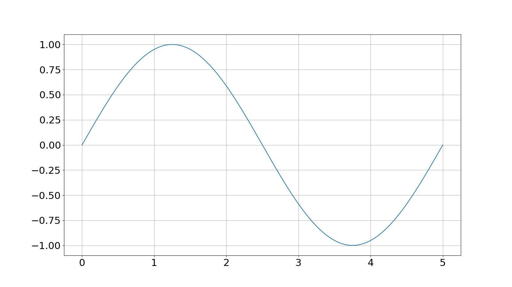
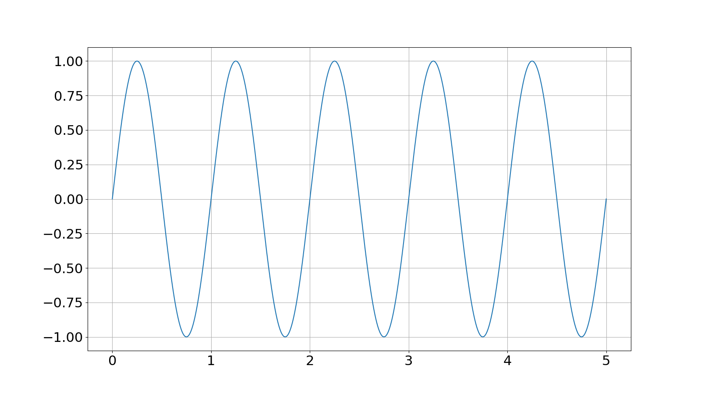
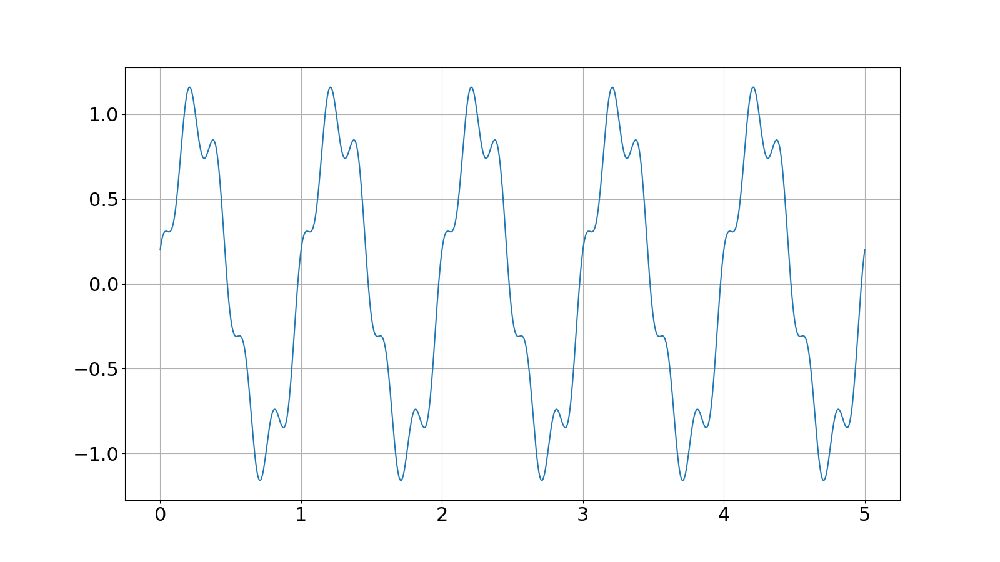
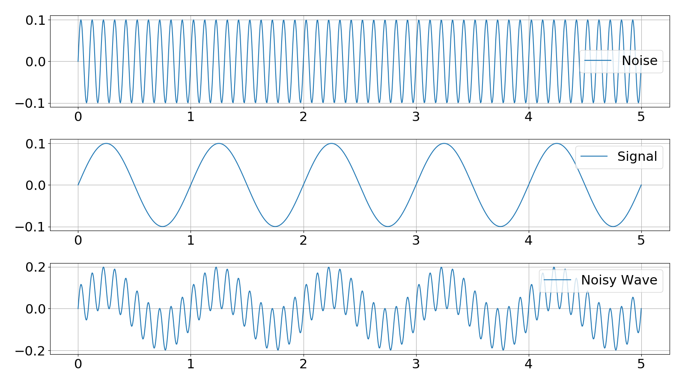
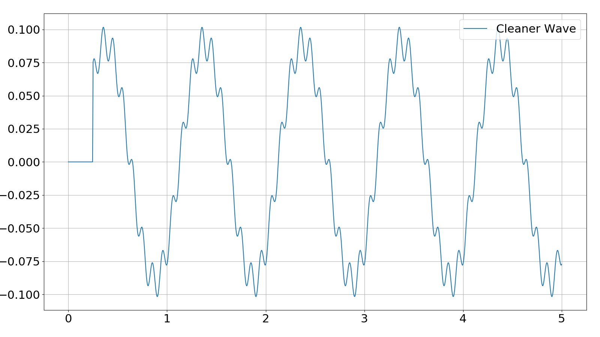

# Lesson 5: Software Low Pass Filter

The objective for this lesson is to build a simple low pass filter to remove
the worst of the noise coming from our microphone.

## Time Varying Signals
To understand what a frequency filter is doing, first we need to understand the
signals that we wish to manipulate. In our case, we're dealing with voltage
changing with time, V(t).Frequency is a measure of how often a pattern repeats,
usually measured in units per unit time. For example, the sun rises every day,
homework is assigned at a rate of one per week, a car normally operates at
1000 revolutions per minute, etc.

Let's take a look at some time varying signals






In order we have a pure sine wave with a frequency of 0.2 waves per second
(0.2Hz), the same wave but with a higher frequency (1Hz), a 1Hz wave with
exponential decay, and finally a sine wave with a high frequency low amplitude
cosine added to it.

It's easy to see that there can be many different kinds of time varying waves.
There are however a couple of useful characteristics that are useful to know
when discussing these waves. The two most important ones are the amplitude and
the frequency. Amplitude is a measure of the vertical distance from peak to
trough. Frequency is a measure of how often the wave repeats. However different
parts of the wave might have different frequencies. The inverse of frequency is
the period of the wave. The period is how long it takes to completer one cycle.
There is also the concept of offset and phase shift. Offset is vertical value
the wave is oscillating about. In the above four plots, the exponential decay
plot has an offset of 3. The phase shift is used to shift the start of the wave
 so that more than just simple sine and cosine waves are possible.

## Simple Low Pass Filter
A low pass filter is a filter that discards high frequencies and only lets low
frequencies pass through the filter. Signal processing is a complicated field
with a long history, so be aware that the following discussion is only going to
skim the surface.

Let's think about two time varying waves: signal and noise. We know that the
waves have different frequencies, with the noise being much higher frequency.
If we calculate a running average with a window that is around the size of the
period of the noise wave, we can minimize its effects.




Notice that the wave is not completely clean, we lost a fair chunk of
the wave while calculating running average and the amplitude decreased in total.
This the price we have to pay to use this method. Losing a chunk off the front
is not going to matter to us in the long run because our system will be running
for minutes (and we're throwing away less than a millisecond at worst). The
amplitude decrease is also because our filter is going to take a chunk of the
signal away with the noise.

This kind of low pass filter is far from optimal, but it is very easy to implement.
We just have to remember the last n samples and calculate the average of those
samples.

```c++
  int average( int arr[], int array_size ){
  sum = 0;
  for (int i=0; i<array_size; i++){
    sum = sum + arr[i]
  }
  return sum/array_size
 }
```
Programming wise we should remember that the Arduino does not naturally support
floating point math. We can get around this by only using integer math, but we
might drop some accuracy. One thing we can do is choose to keep more digits by
not dividing by as big of a number. For example if the sample size is 100, we
can divide by 10. Then the ones place takes the space of the first decimal place.

## Circular Buffer
We can build a data structure to make our running average easier to calculate.
As you put elements into a circular buffer, if it runs out memory, it will begin
overwriting the oldest elements. We can build a circular buffer by using an array
and keeping an index to the latest position that has been filled. Once the index
increases to the size of the array, we reduce it again to zero. This is easy
to do using the modulo operator.

```c++
const int size_array = 10
int my_array[size_array];
int index = 0;

void add_element_to_buffer(int element){
  my_array[index] = element;
  index++;
  index = index%size_array
}
```

## Tasks
* Remove the DC offset from the signal
* Set up a low pass filter to remove the worst of the noise
