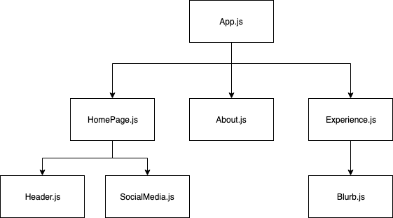

## Goals
+ Add CSS to pages so they stack properly and can start being designed
+ Add a background to our webpage
+ Learn about how React Components and props work
+ Create social media icons for our homepage

## Notes
+ We will start building our webpages this class! We will have a set style/CSS that we follow, but feel free to deviate from the styles if you like. However, for the meantime we will for the most part assume you are all following along with us.

For those who could not make it to the last class, please check out our previous lessons to catch up! Lesson 2 was for setting up our apps, so if you do not have that done yet you can use this link to follow along with us in class: 

https://codesandbox.io/embed/lesson-2-completed-mqo5u

Everything in this sandbox is set up generally the same as the actual React app, so you should still be able to follow along!

## CSS for displaying pages

```CSS
.page {
  position: relative;
  height: 100vh;
}
```

Now we have to include the class in the parent `<div>` of each of our page components. The syntax for this is `<div className="page">`

## CSS for background images

```CSS
.background {
  background-repeat: no-repeat;
  background-size : 100%;
  background-image: url("../images/YOUR_IMAGE");
}
```

Put this one in your App.js 

You can also put a gradient instead of a picture (still looks very professional!!!) 

## CSS for centering stuff on page

```CSS
.centre {
  text-align: center;
}
```

This is just general CSS for us to centre things like our name in our home page. Something like centering your text is reusable, which is why we are taking the extra step to make it a class!


## React Components and Props
 

Some important notes about components:
+ Components need to be exported at the end of every file with the command `export default Component_Name`
+ Child components need to be imported at the top of a file that uses them
+ Any attribute given to a component can only be accessed afterwards as a prop
+ Access a prop value with `this.props.prop_name`

Some important notes about props:
+ Props make components reusable a whole bunch of times so your code looks neater
+ A prop is given as an attribute in the parent component, which makes it accessible in the child component
+ The order that props are declared in the parent component does not matter!
```javascript
class Parent extends Component {
  render() {
    return (
      <Child information="Hello world!" />
    )
  }
}

class Child extends Component {
  render() {
    return (
      <div>
        {this.props.information} // will print "Hello world!"
      </div>
    )
  }
}
```

## Social media icons


Before you start:
+ Save all the social media icons you want to use inside your images folder
+ Create a new file called `Icon.js`
+ Discuss what props we want - which parts of an icon are reusable?
+ ```npm install node-sass```
+ Change the file ending in .css to .scss (App one only)

In `Icon.js`, we're gonna put the following code:
```javascript
import React from 'react'

class Icon extends React.Component {
  render() {
    return (
      <a href={this.props.link} target="_blank" className="icon">
        
      </a>
    );
  }
}

export default Icon;
```

This will need to be imported into our Homepage.js so that it can be used. We also need to do this for our icon images. 

```javascript
import Icon from './Icon.js';
import image from '../images/background.jpg';
```

Now we get to use the icon stuff we created! Recall what we discussed for props; props are variables passed down to a CHILD component from its PARENT component. 

In this case, our child component is Icon, and Homepage is its parent. (but between App and Homepage, Homepage is the child and App is the parent)

```javascript
<div>
  <Icon link="https://www.twitter.com" image={TwitterImage} />
 <div>
```

And then some CSS for an example:
```CSS
.icon {
  border: 2px solid black;
  border-radius: 50%;
  color: white;
  padding: 10px;
  text-align: center;
  display: inline-block;
  width: 60px;
  height: 60px;
  margin: 0 5px;
  &:hover { transform: scale(1.1); }
}

.centreImage {
  padding-top: 8px;
}
```
