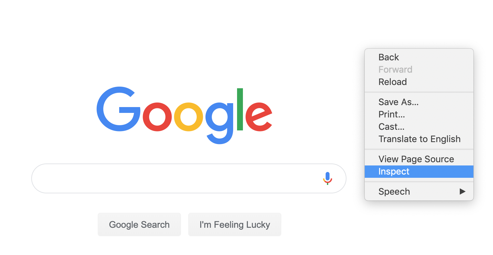
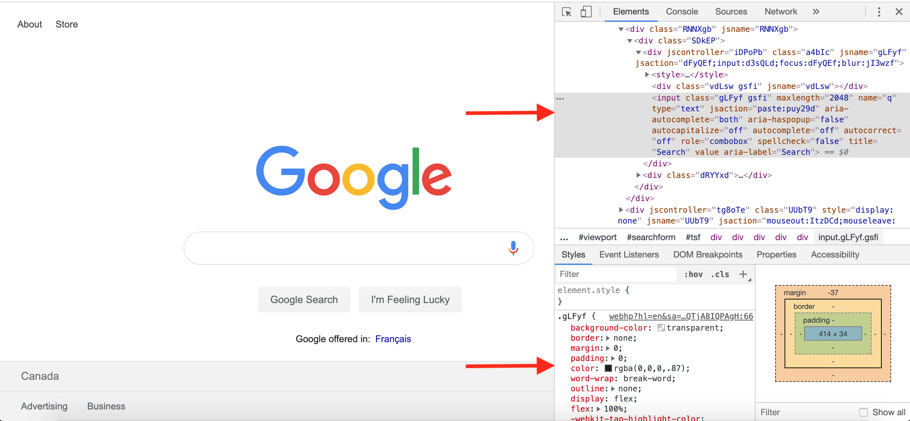

# Lesson 1

Onboarding:
+ join Slack channel
+ show everyone how to get to Github

Goals:
+ Understand the basics of HTML - what makes up a website
+ Understand the basics of CSS - formatting and making things look pretty
+ Use the inspect tool to modify HTML and CSS in browser windows
+ Write a basic HTML file in whatever text editor you have available :)


## HTML

HTML stands for Hyper Text Markup Language. It is a programming language used to create web pages. It directly holds words, input fields, images, checkboxes, and all the other things you may see around the Internet in it. HTML is built using "tags" that look `<span>Like This</span>`. When this is rendered on a webpage, the word "span" (called a tag), tells its contents how it should look and behave. The opening `<span>` says where the tag starts, and the closing `<\span>` (denoted with the backwards slash), shows where it ends.

Lots of different tags exist, and they are all placed inside one parent tag, typically either a `<bod>` or a `<div>`. 

Below is a piece of HTML code. It's got a couple different kinds of tags in it, which we will go through in class. To render this to a webpage, open up your favourite text editor (on a Mac, my go-to is TextEdit), and save this code in a file called hello.html. In TextEdit, you may need to go into the preferences and select 'Plain Text' if this is not working correctly. After you save the file, you can click on it to open it up in your preferred browser, and see the website you have created!

```HTML
<body>
  <h1>Hello, world!</h1>
  <div>
     This is a div. A div is used to divide things vertically down the page. Inside this div is a paragraph I copied from wikipedia about penguins.
    <p>
      Penguins (order Sphenisciformes, family Spheniscidae) are a group of aquatic flightless birds. They live almost exclusively in the Southern Hemisphere, with only one species, the Galapagos penguin, found north of the equator. Highly adapted for life in the water, penguins have countershaded dark and white plumage, and their wings have evolved into flippers. Most penguins feed on krill, fish, squid and other forms of sea life which they catch while swimming underwater. They spend roughly half of their lives on land and the other half in the sea.
    </p>
    
    <div>
      <a href="https://en.wikipedia.org/wiki/Penguin">This is a link to the wikipedia article about penguins</a>
    </div>
  </div>
</body>
```

Some other tags you may want to try playing around with can be found <a href="https://www.tutorialspoint.com/html/html_basic_tags.htm">here</a>. Tags are used to create input fields, buttons, images, and more!

// Add stuff here about attributes in tags?

You may notice after some playing around that everything looks the same in HTML. Using only HTML, there is no way to customize what your elements look like, how they behave, or what they do. For these things, we require a combination of CSS and Javascript. CSS we will discuss today, and Javascript in the upcoming weeks.

## CSS
CSS stands for Cascading Style Sheets. It is not so much a typical programming language, and rather a list of properties you assign a name to, which you can then assign to different elements in your code. These lists of properties in CSS are called **classes**. For example, a class for a button might look like this:

```CSS
.myButton {
    height: 50px;
    width: 100px;
    background-color: green;
    border: 3px solid darkgreen;
    border-radius: 20px;
}
```
It is here that we can store information about what we want our button to look like. After this is written, it then has to be separately attached to the HTML. We do this with the attribute `class` or `className`. For example, something like `<button className="myButton">Button Text Here</button>`.

***

Some hands on CSS:

Go to http://www.cssdesk.com/. Delete all the code under "CSS". Add in the HTML code from above under "HTML". You will then want to add 

```CSS
body {
  background: white;
}
```
Now we can play around with the CSS on our page!

## The Inspect Tool

The Inspect Tool is a tool on most browsers that allows you to view and edit the HTML and CSS of websites live. On Chrome, you can access the inspect tool by right clicking and clicking Inspect



It will look like this when the menu opens! There are two important parts of this menu right now, shown by the arrows below. The top part shows all the HTML making up the current webpage. The bottom part is the CSS. You can manipulate both of these live! Try it out



## Activity

Try replicating the webpage shown below using the tools we taught you! Open up http://www.cssdesk.com/, and replace the HTML and CSS sections with the code we included above. 


