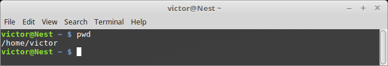
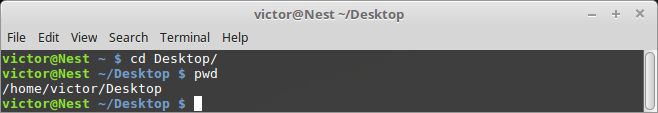
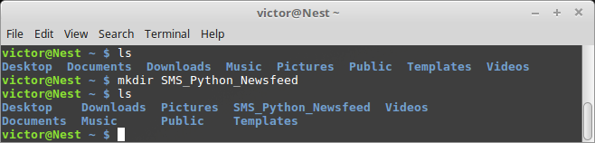
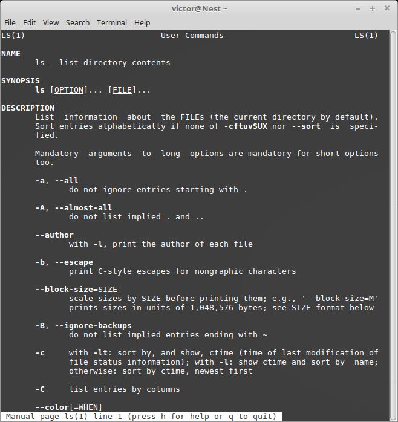
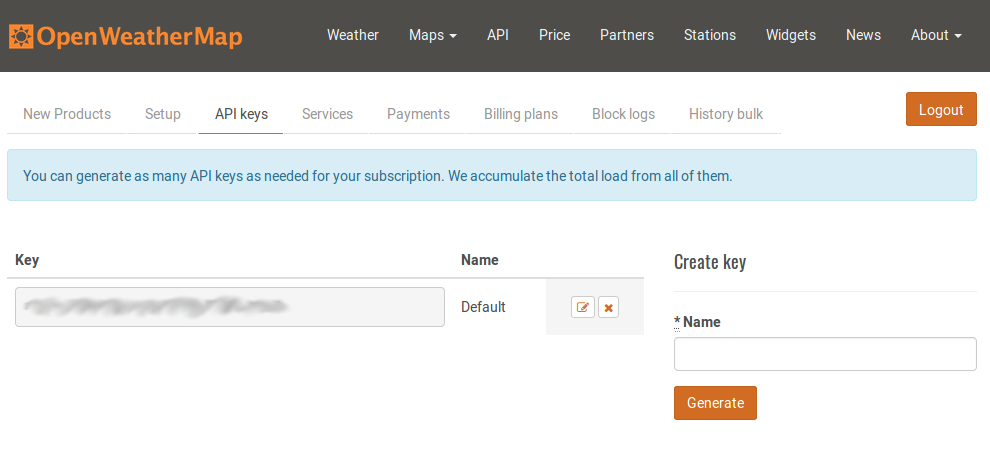
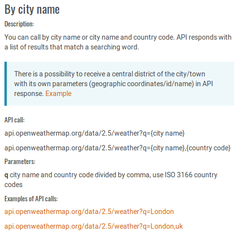
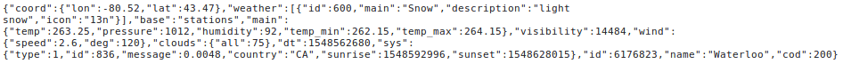

# Lesson 1

In this lesson we have two goals:
1. Learn how to navigate your file structure using the command line (terminal, bash, command prompt, etc)
2. Start taking a look at how a simple web API works

To do these you will only need a computer with access to a web browser.
We will not be doing any complicated programming in this lesson.

### Making a quick account
We need to make an account at [OpenWeatherMap](https://www.openweathermap.org) to get an API key.
Crucially it takes them about an hour to authorize the key, so we'll do this before talking about the command line, and get back to it afterwards. Go ahead and make an account with them before you keep going.

## Command Line Interface
You might be wondering why we care about learning to use the command line interface.
The answer is actually very simple: it is a very powerful tool that basically every computer will have.
In fact some computers don't even have a graphical user interface, that is an environment with windows and mouse pointers.
This is especially true for most web servers.
They exists in a _headless_ configuration, that is to say without a monitor attached.
The only way to use these machines is to connect remotely in to a command line interface from your own computer.

Now, we don't have to become experts, but we need to be able to do a set of basic tasks, and become confident about searching online when we don't know how to do something. Let's start by first opening up our command line interface (cli). 
In Windows you'll generally have two options: command prompt or PowerShell.
I recommend using PowerShell; command prompt has its own set of commands, that while not difficult to use, would be harder to teach since PowerShell uses the same commands found in Linux and Mac. 
Having said in Linux and Mac you just need to open a terminal. 
On Mac you can use Spotlight to search for terminal, while on Linux you can do the same but some Linux distros will give you a variety of terminal options. 
If in doubt use bash.

### Common Commands
The first thing we need to do is figure out _where_ we are.
That is what folder we're currently working in.
This can be done with the `pwd` command, which stands for Print Working Directory.

Now that we know where we are, we can worry about _files_ are in this directory.
We can _list_ the files in the directory by using the `ls` command.
You'll obviously see different directories and files listed for your own computer.

(Aside: One of the big differences if you decide to use command prompt is that `ls` is not a command, instead you use `dir`)

Now that we know where we are and what is around us, we need to figure out how to _go_ there.
For this we'll use the `cd` command to Change Directories.
Unless you've drastically changed your computer you'll have a Desktop folder.
Let's go there by using `cd Desktop`.
It is imporant that you match the case of the directory (lowercase vs uppercase), but for longer names you can use TAB to autocomplete.

Notice how the line you normally type in changed when you cd'ed into your Desktop.
You can use this to complement `pwd`.
I did use `pwd` here for completeness though.

If you want to go back _up_ to the previous directory we were in, you would use `cd ..`.
That is two dots.
This will move you one directory up the hierarchy.

We're almost done this section, we just need to learn two more basic things: how to make a directory (also called a folder) and how to find the documentation for commands.

Making a directory is super easy.
First make sure you are in the right place to make your new folder.
Then call `mkdir <name of new directory>`.
This stands for Make Directory with the following name.

If you want to use Spaces in the name of the directory you'll need to escape them with a backslash.
For example `mkdir My\ Brand\ New\ Folder`.
I generally recommend you stick to using underscores and hyphens if you need to space out text as using Spaces tends to get tedious because of all the escape characters.

### Getting Help
Now what happens if you see some useful code in StackOverFlow, but you want to know how, or why it works?
This is why we have documentation.
The documentation will explain to you the function of a command and the syntax to use it.
Some documentation will even give you useful examples so that you can see how to use the command in question.
We can bring up the documentation with `man <command>`; ie get the manual for the command.
Let's try with `ls`

Once you're in you can scroll down using the arrow keys, and quit using `q`.

Try reading the documentation for the `cat` command.
Can you imagine use cases where it might be useful?

## Web API's

An Application Programming Interface is documented way of communication with an application using common programming tools.
In essence it is translator so that our code can talk with somebody else's code.

### An Analogy
You sit down at a restaurant to order food. 
The waiter comes out and gives you a menu. 
These are all the valid food choices that you can make at this restaurant.
You decide what you want and call the waiter over to place your order.
The waiter passes that to the kitchen, where the staff make your dish.
After some time, the waiter returns with your dish.

In this analogy the menu is the documentation, the waiter is the translator and the two pieces of code are you and the entire kitchen staff.
You need to make a valid choice from the menu, if you don't the waiter will either not take your order or might return something that doesn't make sense (garbage-in, garbage-out).
The kitchen staff is very well trained to execute the orders on the menu, and in fact they don't care what you do with the food, the same way you don't care how the food is made so long as it is good.

You can imagine the same idea playing out with computers.
You ask your maps service to tell you where the nearest mall is located.
Your phone asks an API that takes in your geolocation and returns points of interest.
How this happens does not matter to your phone, the same way that the server that returns the points of interest does not care why you need that information.

### An API call
Let's make our first API call.
By now your API key with OpenWeatherMap should have been authenticated.
The API key is a way for the server to know who we are, and make sure we're allowed to use their service.
One of the reasons they do this is to enforce restrictions between free and paid accounts.
You should always treat any API keys like you would treat any password: don't give it to anyone, keep it somewhere safe, and never upload somewhere public (like github for example.)

You can find your api key after you [log in](https://www.openweathermap.org).
You'll see a tab in the body of the page with the title "API Keys".

Keep this tab while you open another tab to OpenWeatherMap's [documentation](https://openweathermap.org/api).
With a free account we only get access to the Current Weather data and the 5 day / 3 hour forecast.
For now click to get the API documentation for the current weather data and scroll down to the "By city name" section.

Here we can see how an API call is made to this service.
They provide you with an endpoint: `api.openweathermap.org/data/2.5/`
This is where you need to go to use the API, but remember that this is not intended to be human readable.
It is designed to be machine readable.
The api needs to know what you're asking from it, so we need to pass some parameters.
First we need to tell it what kind of forecast we're after; in this case we want the `weather`.

`api.openweathermap.org/data/2.5/weather`

Now we need to tell it for which _city_ we want the weather. We can pass extra parameters to this api by first adding a question mark, and then naming the parameter we want to pass and giving it a value: `q=Waterloo,ca`.

`api.openweathermap.org/data/2.5/weather?q=Waterloo,ca`

At this point you'd think we're done, but we still have not told the server _who we are_.
For that we need the API key.
Let's copy that onto our clipboard now.
To pass the API key, we need to pass the parameter `appid`.
We can pass multiple parameters by separating them with an ampersand: &.

`api.openweathermap.org/data/2.5/weather?q=Waterloo,ca&appid=<insert your own key here>`

If you go to that URL, the server will look at the parameters you have given and fulfill your request.
Just like in the restaurant, we have picked from the menu and asked the kitchen to fufill our request.

Remember that is meant to be read by a machine.
The raw data is actually in a format called json, or JavaScript Object Notation.
We will revisit this point later.
For now see if you can decipher the weather outside from this representation, or you can try getting the weather for other cities.

Some of you will have noticed that the temperature is not in degrees Celcius.
You can ask the API to return the weather to you in metric units.
The documentation to do so is on the same page that the "by city name" documentation is in.
I encourage you figure out how to do this, though we will eventually go over it.

### Some Remarks
OpenWeatherMap's free tier only updates the weather every 2 hours, so don't expect minute-by-minute accuracy.
You are allowed to make 60 api calls per minute with the free account.
If you go over, the API will return an error until the next minute starts and you 60 fresh calls.
*Always treat your API key like a password. Protect it the same way.*

## Conclusions
If you made it this far then it's safe to say that now you have an idea for how to navigate the command line interface on your computer. We learned how to find out where we are using `pwd`, list files in our working directory using `ls`, change directories using `cd` and even how to make new directories with `mkdir`. Finally we also learned how to fetch the documentation for these or any other commands by using `man <command>`.

Separately we also learned how to make an API call, using OpenWeatherMap. We made an account to get an API key and learned how to construct the url we need to get the current weather in Waterloo,CA. This involved finding the API endpoint, and passing the right parameters, including our API key, to get a machine readable json file with the weather.

In the next lesson we'll start doing some real programming by installing Python and sending our first text message.
