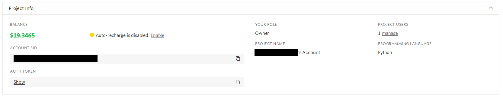

# Lesson 3
For this week we again have two goals:
  1. We want to install the Twilio Python library and make an account with them to send our first SMS
  2. Put the weather requests function together with the SMS functionality to text ourselves the weather

Let's go!

## Twilio
[Twilio](https://www.twilio.com/) is a _plataform as a service_ (PaaS) company that we can use to send/receive text messages, and even handle phone calls.
They have a web API available that we could directly access if we wanted to, but they also make available a Python library that will handle all the details of talking with their API.

### Making an Account
First let's make an account with [them](https://www.twilio.com/try-twilio).
You'll be asked the usual kinds of questions (email, password, name) and a couple of extra questions, such as how confident you're programming and for a phone number to test the service with.
When you're asked for a phone number you'll be asked to confirm it by putting in the code they'll text to that number.

After you have an account, they'll walk you through getting a phone number and you'll be shown your API key and SID (an internal identifier for your app.)



Again, treat your API key like a *password*.
If someone has your API key and SID they can drain your Twilio balance ($$$$)!

### Installing Python Library
We'll now want to install [Twilio's Python library](https://pypi.org/project/twilio/).
We can do this by running `pip install twilio`.
Some of you might need to use `pip3 install twilio`.
If you're not sure try running `pip -V` and `pip3 -V`.
You should be using the one that is matched to your Python3 installation.

We should check that we did manage to install the library by opening up a python interpreter the command line.

```python
>>> import twilio
>>>
```

If you get an error something has gone wrong.
Try seaching for the error that comes up, or ask for help.

### Sending our first SMS
Twilio actually has some fantastic documentation on how to send a text message using their platform.
We will be following this [guide](https://www.twilio.com/docs/sms/quickstart/python#send-an-outbound-sms-with-python) to send our SMS.
I won't be going over everything they say, their explanation is pretty good.
I did copy their code here just for easy reference; as you can see it is pretty compact.

```python
# Download the helper library from https://www.twilio.com/docs/python/install
from twilio.rest import Client


# Your Account Sid and Auth Token from twilio.com/console
account_sid = 'ACXXXXXXXXXXXXXXXXXXXXXXXXXXXXXXXX'
auth_token = 'your_auth_token'
client = Client(account_sid, auth_token)

message = client.messages \
                .create(
                     body="Join Earth's mightiest heroes. Like Kevin Bacon.",
                     from_='+15017122661',
                     to='+15558675310'
                 )

print(message.sid)
```

You can change the body of the message to send anything you want. Try it!

Twilio gave us $15 of credit to try out their platform.
They charge per month that you hold onto one of their phone numbers ($1/month) and per SMS sent (~$0.01/message).
So overall it is pretty cheap to use their service, but not free.

Treat your like API key like a *password*.
Do not share it or post it online.
Be careful when you're showing your code to people online that you don't accidentally upload your API key.

## Text the Weather

Now that we can send a text message and get the weather from [OpenWeatherMap](https://www.openweathermap.org), we can put both of them together to send a text message with the weather!

First we'll need to get the weather and process the json into a Python dictionary.
Then we will need to extract the information we want and put it into a string.
Finally, we will use the Twilio API to send that string to our phones.

There is code to get the weather and process the json in [this lesson folder](request_weather.py), in case you're struggling to get this working.
You might need to refamiliarize yourself with [dictionaries](https://docs.python.org/3.7/tutorial/datastructures.html#dictionaries) and [string formatting](https://docs.python.org/3/library/string.html#format-string-syntax).

## Conclusions
This week we made a Twilio account and sent our first SMS.
We did that by installing the Twilio Python library and modifying Twilio's example code.
There are always a few caveats.
Using Twilio's trial we get $15 of credit, but can only text verified numbers.
Verfied numbers are those that we can confirm we own by quoting back the verification code Twilio send us.
For our project this is not a huge problem since we just want to text ourselves, but if you ever want to expand your application then you'll need to provide a credit card number.
Having said that with $15 we can run our once-a-day text newsfeed for ~10 months without having to worry about any charges.

I probably sound like a broken record: treat your API keys the same way you would treat a *password*.
Don't share it and be mindful when posting code (or pictures of code) online for others to see.

As the exercise for this week we will be combining the two different parts we have so far: requesting the weather and sending an SMS.
There is example code for getting the weather in this lesson folder.

