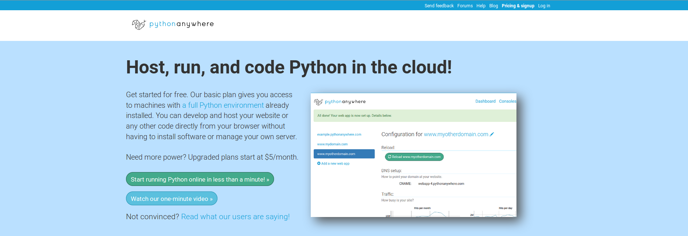
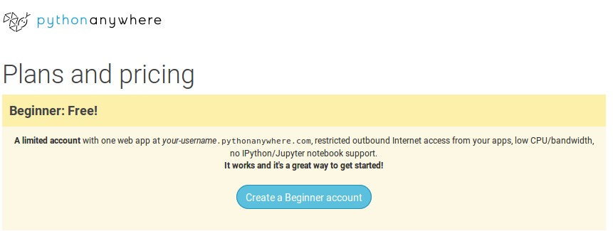
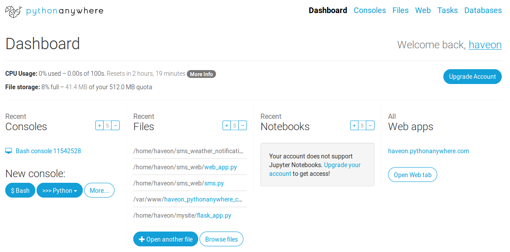
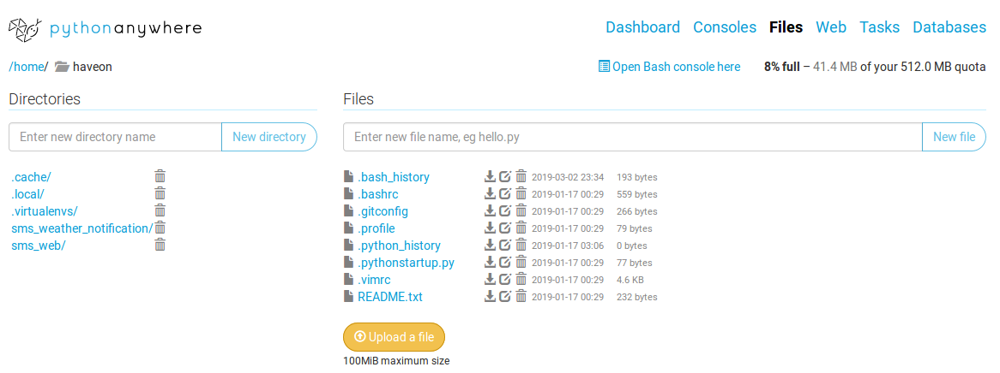
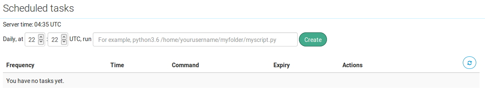

# Lesson 4
For this week we again have only one goal:
  1. Host our code on [PythonAnywhere](https://www.pythonanywhere.com/) and set up our daily SMS Newsfeed

If anyone is catching up, I've provided code for the task that needed to be done for the last lesson in this folder as weather_sms.py.
Home stretch!

## PythonAnywhere
PythonAnywhere is another Platform as a Service (PaaS) which aims to give you an online Python development environment.
It will also allow you to do web hosting, and schedule tasks!

We will be using this service as a way to schedule our weather sending sms code to run every day at a predefined time.
First we'll need to make an account and load our code.
We can do all this under their free acount tier, which give us 100s of daily compute time.
It doesn't sound like much, but our code takes microseconds to run, so it's way more than we need.
Then we'll need to schedule our code to be run everyday.

Let's get started!

### Making an Account
We can go to the official [PythonAnywhere](https://www.pythonanywhere.com/) website and click *Pricing and sign up* on the upper right.



Once we're there we want to click to create a beginner account (you can also check out the pricing below it.)



Then you just need to fill the information that they ask for and probably open a confirmation email in whatever email you provide to them. After that we should be good to go!

### Loading Code and Running it
Now you should be able to see the dashboard.
You can see from left to right: Consoles, Files, Notebooks, Web apps.
Under consoles you can open an actual command line terminal on the PythonAnywhere machine they have provisioned for you.
They have already installed pretty much any Python library you could possibly want, so we won't need to install anything.
Files is where you can see any files you have uploaded to the server. We'll be going here in a second.
Notebooks is locked away unless you pay.
This section will let you use online Jupyter notebooks (which are an amazing tool for datascience).
If you wanted to use a Jupyter notebook you don't need to pay for it, you can just install the library on your computer using pip, but it is nice sometimes to have the ability to do this online.
Finally Web apps is where you can put any websites or web code that you want to execute.
PythonAnywhere will actually host your website for you if you want, and you can write your own server code.
They have good tutorials and great integtations with all the major Python web servers.



Anyways we want to go under *Browse files* now.
And then make a new directory for our code and upload our code to that directory.

What code do we want to upload?
We want to upload a Python script (.py file) that when executed will fetch the weather and send the text message with the weather.



After we've done that we can try to run the code on the server.
To do that we'll need to open a console and execute our code.

```bash
$ python3 path/to/code/your_code.py
```

If you've done everything according to the lessons so far, you should see an error...

### Routing through proxy
So it turns out we have an extra step we need to do.
PythonAnywhere is aware of the error that we just got.
They have [page](https://help.pythonanywhere.com/pages/TwilioBehindTheProxy/) with the solution we need.
The issue is that PythonAnywhere uses a proxy to give us outbound communication with the rest of the Internet.
The reasons for this are a bit complicated, and definitely out of scope for this lesson, but suffice it to say that it has to do with how PythonAnywhere set up how they split their servers into instances.

In any case we'll need to add this bit of code to our file:

```python
from twilio.http.http_client import TwilioHttpClient

proxy_client = TwilioHttpClient()
proxy_client.session.proxies = {'https': os.environ['https_proxy']}
```

Then when we build our client object, we need it to be aware of the proxy so that it can route its communication through it.

```python
client = Client(account_sid, auth_token, http_client=proxy_client) # Notice the keyword argument
```

We can then use our client like we normally would to send a message.
After we have done so, we can try running our code again from the console.
This time we should receive a text message!

### Setting up Scheduled Task
Now we're in the last straightaway.
We need to go back to the dashboard anc click on Tasks on the upper right hand of the screen.
Here we can schedule console commands to be run at periodic intervals.
Under the free account we're using for PythonAnywhere we can schedule one daily task, but that is all we need!



We need to set the time in Coordinated Universal Time (UTC).
UTC is 5 hours ahead of Eastern Standard Time (EST), the time zone Waterloo, ON is in.
So if we want to schedule this for 7:30am EST, we'll need to add 5 hours to get the right UTC (12:30pm).
Finally we add the console command we want to run daily at that time.

```bash
$ python3 path/to/code/your_code.py
```

You have to get the command right, otherwise it will try to run at the next scheduled time, crash, and not do anything.
It won't even warned you that something has gone wrong.

If we have done everything right, then you should start getting a new daily text message with the weather once a day!

## Conclusions
So today we used PythonAnywhere to set up a daily task that will run our weather sms script once a day.
We made an account with PythonAnywhere and learned how to upload our code to their server and execute it on the console.
We also learned how to add a daily task that can be executed at any time of the day.
We had to fix a samall issue with Twilio, but we saw that PythonAnywhere had the right documentation to help us fix the problem.

A couple of important things to note.
PythonAnywhere, like Twilio is looking to make money.
Unlike Twilio, PythonAnywhere's free tier doesn't have any time restrictions, so you can continue using it indefintely.
We just have to be aware of the limitations: you only get 100s of compute time per day, no access to online jupiter notebooks, you only get one daily task to schedule and most importantly we can only connect to a set of [white listed sites](https://www.pythonanywhere.com/whitelist/).
This turns out to not be a huge issue since they have hundred of sites on that list.
Their pricing is actually pretty reasonable $5USD/month will get you 2000s of compute time per day and lift the other restrictions.
Under the free tier you can also host a website with them, but only at <username>.pythonanywhere.com; if you become a paying memeber you can use the service to host any domain you want.
Having said all that, there are other options we could have used, like GoogleCloud and Amazon Web Services (AWS), but I find that PythonAnywhere is powerful, while still remaining simple enough for the task we set out to do.

In any case... We're done!
This was pretty much the project we had set out to build almost 2 months ago.
My hope is that now, you use your skills to query more APIs and make your morning newsletter your own.
Like I said above, PythonAnywhere has a list of available APIs [here](https://www.pythonanywhere.com/whitelist/), and if you're willing to throw some money their way you can access any site on the Internet without restrictions.

Happy Coding!
